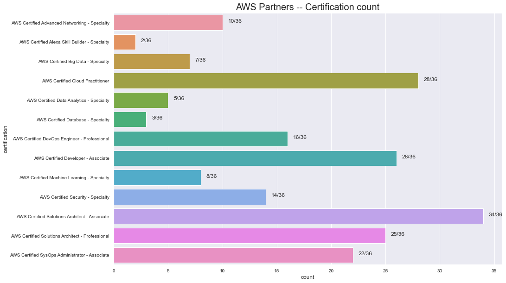
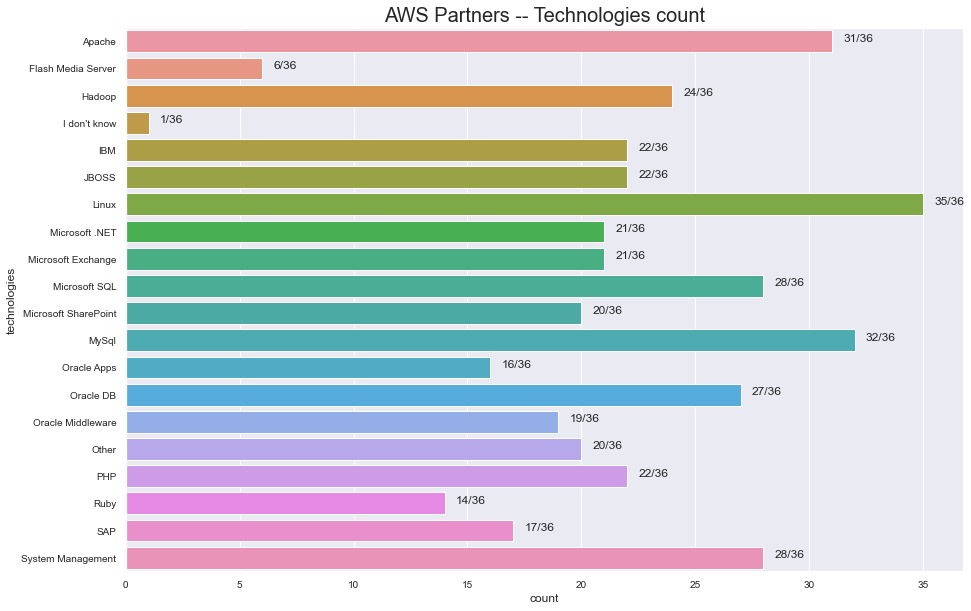
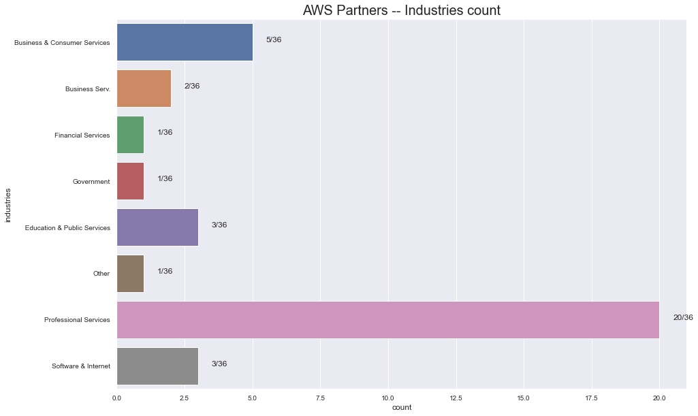
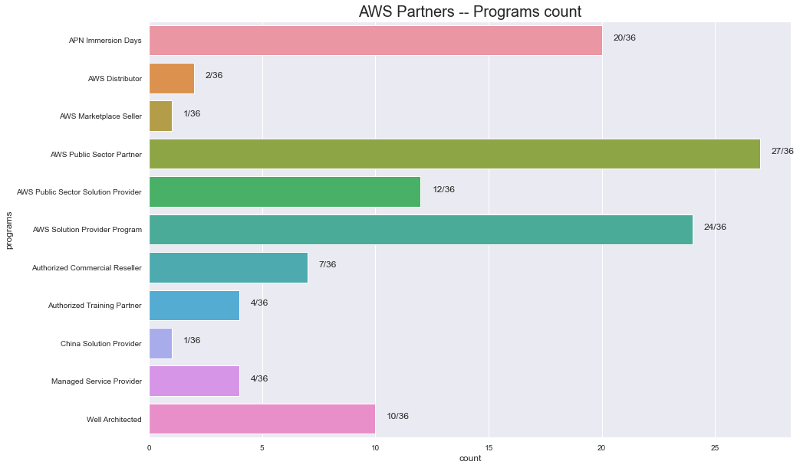
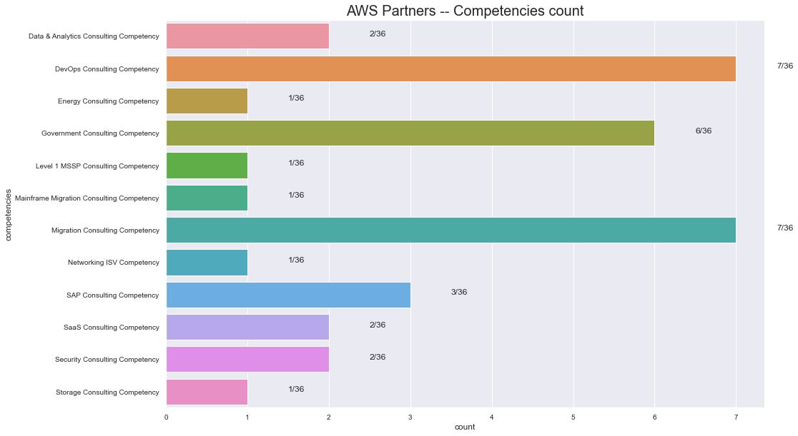
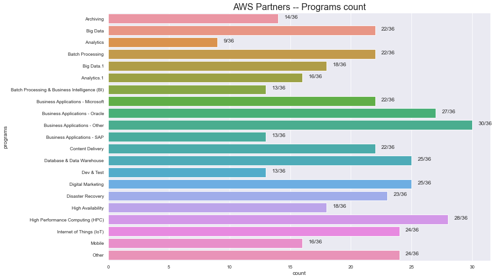
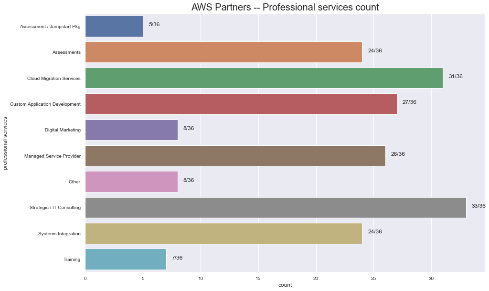
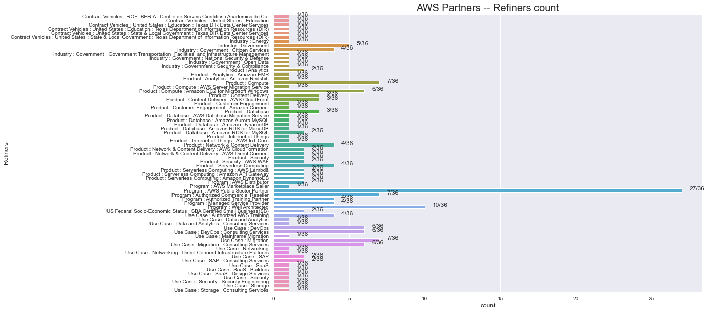
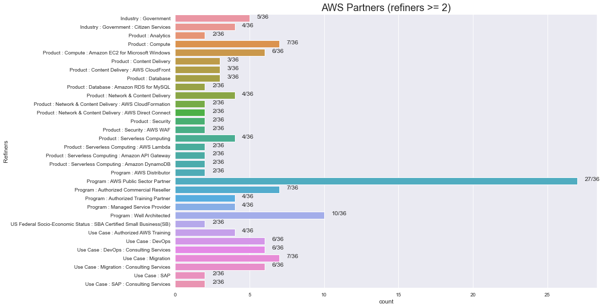
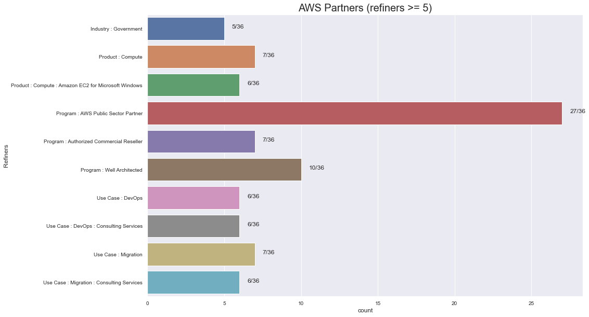

# AWS Partner Opportunities

Al fine di valutare lo scenario della competition


```python
import pandas as pd
import matplotlib.pyplot as plt

import seaborn as sns

sns.set_theme(style="darkgrid")
#sns.set(rc = {'figure.figsize':(15,10)})
space=0.5

from IPython.display import display, HTML, Markdown as md

from itertools import chain,cycle

CSS = """
.output {
    flex-direction: row;
}
"""

#HTML('<style>{}</style>'.format(CSS))

```


```python
DATA_FOLDER = '../data/'
```

## AWS Partners

Partner list is retrieved from AWS APN Portal(https://partners.amazonaws.com/), extracting only _consulting partners_ belonging to the _Advanced_ tier, and with active operations in Italy.


```python
partn = DATA_FOLDER + 'partners.csv'
dfp = pd.read_csv(partn)
dfp.loc[dfp['international'] != 1.0, 'international'] = False
dfp.loc[dfp['international'] == 1.0, 'international'] = True
display(dfp.style.hide_index())
```


<style  type="text/css" >
</style><table id="T_a6e1c258_61b2_11ec_940c_acde48001122" ><thead>    <tr>        <th class="col_heading level0 col0" >name</th>        <th class="col_heading level0 col1" >launches</th>        <th class="col_heading level0 col2" >professional_services</th>        <th class="col_heading level0 col3" >solutions</th>        <th class="col_heading level0 col4" >competencies</th>        <th class="col_heading level0 col5" >certifications</th>        <th class="col_heading level0 col6" >programs</th>        <th class="col_heading level0 col7" >use_cases</th>        <th class="col_heading level0 col8" >international</th>        <th class="col_heading level0 col9" >references</th>    </tr></thead><tbody>
                <tr>
                                <td id="T_a6e1c258_61b2_11ec_940c_acde48001122row0_col0" class="data row0 col0" >Almaviva S.p.A.</td>
                        <td id="T_a6e1c258_61b2_11ec_940c_acde48001122row0_col1" class="data row0 col1" >28</td>
                        <td id="T_a6e1c258_61b2_11ec_940c_acde48001122row0_col2" class="data row0 col2" >8</td>
                        <td id="T_a6e1c258_61b2_11ec_940c_acde48001122row0_col3" class="data row0 col3" >0</td>
                        <td id="T_a6e1c258_61b2_11ec_940c_acde48001122row0_col4" class="data row0 col4" >2</td>
                        <td id="T_a6e1c258_61b2_11ec_940c_acde48001122row0_col5" class="data row0 col5" >11</td>
                        <td id="T_a6e1c258_61b2_11ec_940c_acde48001122row0_col6" class="data row0 col6" >4</td>
                        <td id="T_a6e1c258_61b2_11ec_940c_acde48001122row0_col7" class="data row0 col7" >15</td>
                        <td id="T_a6e1c258_61b2_11ec_940c_acde48001122row0_col8" class="data row0 col8" >False</td>
                        <td id="T_a6e1c258_61b2_11ec_940c_acde48001122row0_col9" class="data row0 col9" >2</td>
            </tr>
            <tr>
                                <td id="T_a6e1c258_61b2_11ec_940c_acde48001122row1_col0" class="data row1 col0" >ARHS Spikeseed</td>
                        <td id="T_a6e1c258_61b2_11ec_940c_acde48001122row1_col1" class="data row1 col1" >58</td>
                        <td id="T_a6e1c258_61b2_11ec_940c_acde48001122row1_col2" class="data row1 col2" >5</td>
                        <td id="T_a6e1c258_61b2_11ec_940c_acde48001122row1_col3" class="data row1 col3" >2</td>
                        <td id="T_a6e1c258_61b2_11ec_940c_acde48001122row1_col4" class="data row1 col4" >2</td>
                        <td id="T_a6e1c258_61b2_11ec_940c_acde48001122row1_col5" class="data row1 col5" >7</td>
                        <td id="T_a6e1c258_61b2_11ec_940c_acde48001122row1_col6" class="data row1 col6" >5</td>
                        <td id="T_a6e1c258_61b2_11ec_940c_acde48001122row1_col7" class="data row1 col7" >11</td>
                        <td id="T_a6e1c258_61b2_11ec_940c_acde48001122row1_col8" class="data row1 col8" >True</td>
                        <td id="T_a6e1c258_61b2_11ec_940c_acde48001122row1_col9" class="data row1 col9" >10</td>
            </tr>
            <tr>
                                <td id="T_a6e1c258_61b2_11ec_940c_acde48001122row2_col0" class="data row2 col0" >Arrow</td>
                        <td id="T_a6e1c258_61b2_11ec_940c_acde48001122row2_col1" class="data row2 col1" >1</td>
                        <td id="T_a6e1c258_61b2_11ec_940c_acde48001122row2_col2" class="data row2 col2" >4</td>
                        <td id="T_a6e1c258_61b2_11ec_940c_acde48001122row2_col3" class="data row2 col3" >0</td>
                        <td id="T_a6e1c258_61b2_11ec_940c_acde48001122row2_col4" class="data row2 col4" >0</td>
                        <td id="T_a6e1c258_61b2_11ec_940c_acde48001122row2_col5" class="data row2 col5" >6</td>
                        <td id="T_a6e1c258_61b2_11ec_940c_acde48001122row2_col6" class="data row2 col6" >4</td>
                        <td id="T_a6e1c258_61b2_11ec_940c_acde48001122row2_col7" class="data row2 col7" >11</td>
                        <td id="T_a6e1c258_61b2_11ec_940c_acde48001122row2_col8" class="data row2 col8" >True</td>
                        <td id="T_a6e1c258_61b2_11ec_940c_acde48001122row2_col9" class="data row2 col9" >4</td>
            </tr>
            <tr>
                                <td id="T_a6e1c258_61b2_11ec_940c_acde48001122row3_col0" class="data row3 col0" >ATOS International SAS</td>
                        <td id="T_a6e1c258_61b2_11ec_940c_acde48001122row3_col1" class="data row3 col1" >59</td>
                        <td id="T_a6e1c258_61b2_11ec_940c_acde48001122row3_col2" class="data row3 col2" >6</td>
                        <td id="T_a6e1c258_61b2_11ec_940c_acde48001122row3_col3" class="data row3 col3" >3</td>
                        <td id="T_a6e1c258_61b2_11ec_940c_acde48001122row3_col4" class="data row3 col4" >4</td>
                        <td id="T_a6e1c258_61b2_11ec_940c_acde48001122row3_col5" class="data row3 col5" >9</td>
                        <td id="T_a6e1c258_61b2_11ec_940c_acde48001122row3_col6" class="data row3 col6" >7</td>
                        <td id="T_a6e1c258_61b2_11ec_940c_acde48001122row3_col7" class="data row3 col7" >17</td>
                        <td id="T_a6e1c258_61b2_11ec_940c_acde48001122row3_col8" class="data row3 col8" >True</td>
                        <td id="T_a6e1c258_61b2_11ec_940c_acde48001122row3_col9" class="data row3 col9" >14</td>
            </tr>
            <tr>
                                <td id="T_a6e1c258_61b2_11ec_940c_acde48001122row4_col0" class="data row4 col0" >atSistemas</td>
                        <td id="T_a6e1c258_61b2_11ec_940c_acde48001122row4_col1" class="data row4 col1" >21</td>
                        <td id="T_a6e1c258_61b2_11ec_940c_acde48001122row4_col2" class="data row4 col2" >6</td>
                        <td id="T_a6e1c258_61b2_11ec_940c_acde48001122row4_col3" class="data row4 col3" >0</td>
                        <td id="T_a6e1c258_61b2_11ec_940c_acde48001122row4_col4" class="data row4 col4" >0</td>
                        <td id="T_a6e1c258_61b2_11ec_940c_acde48001122row4_col5" class="data row4 col5" >3</td>
                        <td id="T_a6e1c258_61b2_11ec_940c_acde48001122row4_col6" class="data row4 col6" >5</td>
                        <td id="T_a6e1c258_61b2_11ec_940c_acde48001122row4_col7" class="data row4 col7" >10</td>
                        <td id="T_a6e1c258_61b2_11ec_940c_acde48001122row4_col8" class="data row4 col8" >True</td>
                        <td id="T_a6e1c258_61b2_11ec_940c_acde48001122row4_col9" class="data row4 col9" >8</td>
            </tr>
            <tr>
                                <td id="T_a6e1c258_61b2_11ec_940c_acde48001122row5_col0" class="data row5 col0" >Azatec Consulting</td>
                        <td id="T_a6e1c258_61b2_11ec_940c_acde48001122row5_col1" class="data row5 col1" >24</td>
                        <td id="T_a6e1c258_61b2_11ec_940c_acde48001122row5_col2" class="data row5 col2" >6</td>
                        <td id="T_a6e1c258_61b2_11ec_940c_acde48001122row5_col3" class="data row5 col3" >4</td>
                        <td id="T_a6e1c258_61b2_11ec_940c_acde48001122row5_col4" class="data row5 col4" >1</td>
                        <td id="T_a6e1c258_61b2_11ec_940c_acde48001122row5_col5" class="data row5 col5" >5</td>
                        <td id="T_a6e1c258_61b2_11ec_940c_acde48001122row5_col6" class="data row5 col6" >3</td>
                        <td id="T_a6e1c258_61b2_11ec_940c_acde48001122row5_col7" class="data row5 col7" >10</td>
                        <td id="T_a6e1c258_61b2_11ec_940c_acde48001122row5_col8" class="data row5 col8" >True</td>
                        <td id="T_a6e1c258_61b2_11ec_940c_acde48001122row5_col9" class="data row5 col9" >7</td>
            </tr>
            <tr>
                                <td id="T_a6e1c258_61b2_11ec_940c_acde48001122row6_col0" class="data row6 col0" >beSharp</td>
                        <td id="T_a6e1c258_61b2_11ec_940c_acde48001122row6_col1" class="data row6 col1" >72</td>
                        <td id="T_a6e1c258_61b2_11ec_940c_acde48001122row6_col2" class="data row6 col2" >6</td>
                        <td id="T_a6e1c258_61b2_11ec_940c_acde48001122row6_col3" class="data row6 col3" >0</td>
                        <td id="T_a6e1c258_61b2_11ec_940c_acde48001122row6_col4" class="data row6 col4" >3</td>
                        <td id="T_a6e1c258_61b2_11ec_940c_acde48001122row6_col5" class="data row6 col5" >11</td>
                        <td id="T_a6e1c258_61b2_11ec_940c_acde48001122row6_col6" class="data row6 col6" >4</td>
                        <td id="T_a6e1c258_61b2_11ec_940c_acde48001122row6_col7" class="data row6 col7" >15</td>
                        <td id="T_a6e1c258_61b2_11ec_940c_acde48001122row6_col8" class="data row6 col8" >False</td>
                        <td id="T_a6e1c258_61b2_11ec_940c_acde48001122row6_col9" class="data row6 col9" >18</td>
            </tr>
            <tr>
                                <td id="T_a6e1c258_61b2_11ec_940c_acde48001122row7_col0" class="data row7 col0" >China Mobile International Limited</td>
                        <td id="T_a6e1c258_61b2_11ec_940c_acde48001122row7_col1" class="data row7 col1" >22</td>
                        <td id="T_a6e1c258_61b2_11ec_940c_acde48001122row7_col2" class="data row7 col2" >2</td>
                        <td id="T_a6e1c258_61b2_11ec_940c_acde48001122row7_col3" class="data row7 col3" >1</td>
                        <td id="T_a6e1c258_61b2_11ec_940c_acde48001122row7_col4" class="data row7 col4" >1</td>
                        <td id="T_a6e1c258_61b2_11ec_940c_acde48001122row7_col5" class="data row7 col5" >6</td>
                        <td id="T_a6e1c258_61b2_11ec_940c_acde48001122row7_col6" class="data row7 col6" >2</td>
                        <td id="T_a6e1c258_61b2_11ec_940c_acde48001122row7_col7" class="data row7 col7" >2</td>
                        <td id="T_a6e1c258_61b2_11ec_940c_acde48001122row7_col8" class="data row7 col8" >True</td>
                        <td id="T_a6e1c258_61b2_11ec_940c_acde48001122row7_col9" class="data row7 col9" >9</td>
            </tr>
            <tr>
                                <td id="T_a6e1c258_61b2_11ec_940c_acde48001122row8_col0" class="data row8 col0" >Corley srl</td>
                        <td id="T_a6e1c258_61b2_11ec_940c_acde48001122row8_col1" class="data row8 col1" >45</td>
                        <td id="T_a6e1c258_61b2_11ec_940c_acde48001122row8_col2" class="data row8 col2" >5</td>
                        <td id="T_a6e1c258_61b2_11ec_940c_acde48001122row8_col3" class="data row8 col3" >2</td>
                        <td id="T_a6e1c258_61b2_11ec_940c_acde48001122row8_col4" class="data row8 col4" >0</td>
                        <td id="T_a6e1c258_61b2_11ec_940c_acde48001122row8_col5" class="data row8 col5" >2</td>
                        <td id="T_a6e1c258_61b2_11ec_940c_acde48001122row8_col6" class="data row8 col6" >1</td>
                        <td id="T_a6e1c258_61b2_11ec_940c_acde48001122row8_col7" class="data row8 col7" >14</td>
                        <td id="T_a6e1c258_61b2_11ec_940c_acde48001122row8_col8" class="data row8 col8" >False</td>
                        <td id="T_a6e1c258_61b2_11ec_940c_acde48001122row8_col9" class="data row8 col9" >10</td>
            </tr>
            <tr>
                                <td id="T_a6e1c258_61b2_11ec_940c_acde48001122row9_col0" class="data row9 col0" >Elmec Informatica SpA</td>
                        <td id="T_a6e1c258_61b2_11ec_940c_acde48001122row9_col1" class="data row9 col1" >29</td>
                        <td id="T_a6e1c258_61b2_11ec_940c_acde48001122row9_col2" class="data row9 col2" >5</td>
                        <td id="T_a6e1c258_61b2_11ec_940c_acde48001122row9_col3" class="data row9 col3" >0</td>
                        <td id="T_a6e1c258_61b2_11ec_940c_acde48001122row9_col4" class="data row9 col4" >0</td>
                        <td id="T_a6e1c258_61b2_11ec_940c_acde48001122row9_col5" class="data row9 col5" >2</td>
                        <td id="T_a6e1c258_61b2_11ec_940c_acde48001122row9_col6" class="data row9 col6" >2</td>
                        <td id="T_a6e1c258_61b2_11ec_940c_acde48001122row9_col7" class="data row9 col7" >17</td>
                        <td id="T_a6e1c258_61b2_11ec_940c_acde48001122row9_col8" class="data row9 col8" >True</td>
                        <td id="T_a6e1c258_61b2_11ec_940c_acde48001122row9_col9" class="data row9 col9" >2</td>
            </tr>
            <tr>
                                <td id="T_a6e1c258_61b2_11ec_940c_acde48001122row10_col0" class="data row10 col0" >Engineering Ingegneria Informatica S.p.A.</td>
                        <td id="T_a6e1c258_61b2_11ec_940c_acde48001122row10_col1" class="data row10 col1" >24</td>
                        <td id="T_a6e1c258_61b2_11ec_940c_acde48001122row10_col2" class="data row10 col2" >4</td>
                        <td id="T_a6e1c258_61b2_11ec_940c_acde48001122row10_col3" class="data row10 col3" >0</td>
                        <td id="T_a6e1c258_61b2_11ec_940c_acde48001122row10_col4" class="data row10 col4" >0</td>
                        <td id="T_a6e1c258_61b2_11ec_940c_acde48001122row10_col5" class="data row10 col5" >8</td>
                        <td id="T_a6e1c258_61b2_11ec_940c_acde48001122row10_col6" class="data row10 col6" >3</td>
                        <td id="T_a6e1c258_61b2_11ec_940c_acde48001122row10_col7" class="data row10 col7" >16</td>
                        <td id="T_a6e1c258_61b2_11ec_940c_acde48001122row10_col8" class="data row10 col8" >True</td>
                        <td id="T_a6e1c258_61b2_11ec_940c_acde48001122row10_col9" class="data row10 col9" >2</td>
            </tr>
            <tr>
                                <td id="T_a6e1c258_61b2_11ec_940c_acde48001122row11_col0" class="data row11 col0" >EPAM Systems, Inc.</td>
                        <td id="T_a6e1c258_61b2_11ec_940c_acde48001122row11_col1" class="data row11 col1" >128</td>
                        <td id="T_a6e1c258_61b2_11ec_940c_acde48001122row11_col2" class="data row11 col2" >8</td>
                        <td id="T_a6e1c258_61b2_11ec_940c_acde48001122row11_col3" class="data row11 col3" >6</td>
                        <td id="T_a6e1c258_61b2_11ec_940c_acde48001122row11_col4" class="data row11 col4" >4</td>
                        <td id="T_a6e1c258_61b2_11ec_940c_acde48001122row11_col5" class="data row11 col5" >9</td>
                        <td id="T_a6e1c258_61b2_11ec_940c_acde48001122row11_col6" class="data row11 col6" >4</td>
                        <td id="T_a6e1c258_61b2_11ec_940c_acde48001122row11_col7" class="data row11 col7" >19</td>
                        <td id="T_a6e1c258_61b2_11ec_940c_acde48001122row11_col8" class="data row11 col8" >True</td>
                        <td id="T_a6e1c258_61b2_11ec_940c_acde48001122row11_col9" class="data row11 col9" >24</td>
            </tr>
            <tr>
                                <td id="T_a6e1c258_61b2_11ec_940c_acde48001122row12_col0" class="data row12 col0" >Exprivia | Italtel</td>
                        <td id="T_a6e1c258_61b2_11ec_940c_acde48001122row12_col1" class="data row12 col1" >29</td>
                        <td id="T_a6e1c258_61b2_11ec_940c_acde48001122row12_col2" class="data row12 col2" >3</td>
                        <td id="T_a6e1c258_61b2_11ec_940c_acde48001122row12_col3" class="data row12 col3" >0</td>
                        <td id="T_a6e1c258_61b2_11ec_940c_acde48001122row12_col4" class="data row12 col4" >0</td>
                        <td id="T_a6e1c258_61b2_11ec_940c_acde48001122row12_col5" class="data row12 col5" >6</td>
                        <td id="T_a6e1c258_61b2_11ec_940c_acde48001122row12_col6" class="data row12 col6" >4</td>
                        <td id="T_a6e1c258_61b2_11ec_940c_acde48001122row12_col7" class="data row12 col7" >6</td>
                        <td id="T_a6e1c258_61b2_11ec_940c_acde48001122row12_col8" class="data row12 col8" >True</td>
                        <td id="T_a6e1c258_61b2_11ec_940c_acde48001122row12_col9" class="data row12 col9" >5</td>
            </tr>
            <tr>
                                <td id="T_a6e1c258_61b2_11ec_940c_acde48001122row13_col0" class="data row13 col0" >Fast Lane Institute for Knowledge Transfer GmbH</td>
                        <td id="T_a6e1c258_61b2_11ec_940c_acde48001122row13_col1" class="data row13 col1" >35</td>
                        <td id="T_a6e1c258_61b2_11ec_940c_acde48001122row13_col2" class="data row13 col2" >2</td>
                        <td id="T_a6e1c258_61b2_11ec_940c_acde48001122row13_col3" class="data row13 col3" >0</td>
                        <td id="T_a6e1c258_61b2_11ec_940c_acde48001122row13_col4" class="data row13 col4" >0</td>
                        <td id="T_a6e1c258_61b2_11ec_940c_acde48001122row13_col5" class="data row13 col5" >6</td>
                        <td id="T_a6e1c258_61b2_11ec_940c_acde48001122row13_col6" class="data row13 col6" >2</td>
                        <td id="T_a6e1c258_61b2_11ec_940c_acde48001122row13_col7" class="data row13 col7" >7</td>
                        <td id="T_a6e1c258_61b2_11ec_940c_acde48001122row13_col8" class="data row13 col8" >True</td>
                        <td id="T_a6e1c258_61b2_11ec_940c_acde48001122row13_col9" class="data row13 col9" >6</td>
            </tr>
            <tr>
                                <td id="T_a6e1c258_61b2_11ec_940c_acde48001122row14_col0" class="data row14 col0" >Fastweb</td>
                        <td id="T_a6e1c258_61b2_11ec_940c_acde48001122row14_col1" class="data row14 col1" >22</td>
                        <td id="T_a6e1c258_61b2_11ec_940c_acde48001122row14_col2" class="data row14 col2" >5</td>
                        <td id="T_a6e1c258_61b2_11ec_940c_acde48001122row14_col3" class="data row14 col3" >3</td>
                        <td id="T_a6e1c258_61b2_11ec_940c_acde48001122row14_col4" class="data row14 col4" >0</td>
                        <td id="T_a6e1c258_61b2_11ec_940c_acde48001122row14_col5" class="data row14 col5" >2</td>
                        <td id="T_a6e1c258_61b2_11ec_940c_acde48001122row14_col6" class="data row14 col6" >3</td>
                        <td id="T_a6e1c258_61b2_11ec_940c_acde48001122row14_col7" class="data row14 col7" >12</td>
                        <td id="T_a6e1c258_61b2_11ec_940c_acde48001122row14_col8" class="data row14 col8" >False</td>
                        <td id="T_a6e1c258_61b2_11ec_940c_acde48001122row14_col9" class="data row14 col9" >4</td>
            </tr>
            <tr>
                                <td id="T_a6e1c258_61b2_11ec_940c_acde48001122row15_col0" class="data row15 col0" >FLOWING SRL</td>
                        <td id="T_a6e1c258_61b2_11ec_940c_acde48001122row15_col1" class="data row15 col1" >23</td>
                        <td id="T_a6e1c258_61b2_11ec_940c_acde48001122row15_col2" class="data row15 col2" >6</td>
                        <td id="T_a6e1c258_61b2_11ec_940c_acde48001122row15_col3" class="data row15 col3" >1</td>
                        <td id="T_a6e1c258_61b2_11ec_940c_acde48001122row15_col4" class="data row15 col4" >0</td>
                        <td id="T_a6e1c258_61b2_11ec_940c_acde48001122row15_col5" class="data row15 col5" >1</td>
                        <td id="T_a6e1c258_61b2_11ec_940c_acde48001122row15_col6" class="data row15 col6" >1</td>
                        <td id="T_a6e1c258_61b2_11ec_940c_acde48001122row15_col7" class="data row15 col7" >10</td>
                        <td id="T_a6e1c258_61b2_11ec_940c_acde48001122row15_col8" class="data row15 col8" >False</td>
                        <td id="T_a6e1c258_61b2_11ec_940c_acde48001122row15_col9" class="data row15 col9" >4</td>
            </tr>
            <tr>
                                <td id="T_a6e1c258_61b2_11ec_940c_acde48001122row16_col0" class="data row16 col0" >Fujitsu</td>
                        <td id="T_a6e1c258_61b2_11ec_940c_acde48001122row16_col1" class="data row16 col1" >29</td>
                        <td id="T_a6e1c258_61b2_11ec_940c_acde48001122row16_col2" class="data row16 col2" >6</td>
                        <td id="T_a6e1c258_61b2_11ec_940c_acde48001122row16_col3" class="data row16 col3" >2</td>
                        <td id="T_a6e1c258_61b2_11ec_940c_acde48001122row16_col4" class="data row16 col4" >2</td>
                        <td id="T_a6e1c258_61b2_11ec_940c_acde48001122row16_col5" class="data row16 col5" >9</td>
                        <td id="T_a6e1c258_61b2_11ec_940c_acde48001122row16_col6" class="data row16 col6" >5</td>
                        <td id="T_a6e1c258_61b2_11ec_940c_acde48001122row16_col7" class="data row16 col7" >11</td>
                        <td id="T_a6e1c258_61b2_11ec_940c_acde48001122row16_col8" class="data row16 col8" >True</td>
                        <td id="T_a6e1c258_61b2_11ec_940c_acde48001122row16_col9" class="data row16 col9" >15</td>
            </tr>
            <tr>
                                <td id="T_a6e1c258_61b2_11ec_940c_acde48001122row17_col0" class="data row17 col0" >GFT</td>
                        <td id="T_a6e1c258_61b2_11ec_940c_acde48001122row17_col1" class="data row17 col1" >43</td>
                        <td id="T_a6e1c258_61b2_11ec_940c_acde48001122row17_col2" class="data row17 col2" >4</td>
                        <td id="T_a6e1c258_61b2_11ec_940c_acde48001122row17_col3" class="data row17 col3" >3</td>
                        <td id="T_a6e1c258_61b2_11ec_940c_acde48001122row17_col4" class="data row17 col4" >2</td>
                        <td id="T_a6e1c258_61b2_11ec_940c_acde48001122row17_col5" class="data row17 col5" >4</td>
                        <td id="T_a6e1c258_61b2_11ec_940c_acde48001122row17_col6" class="data row17 col6" >1</td>
                        <td id="T_a6e1c258_61b2_11ec_940c_acde48001122row17_col7" class="data row17 col7" >12</td>
                        <td id="T_a6e1c258_61b2_11ec_940c_acde48001122row17_col8" class="data row17 col8" >True</td>
                        <td id="T_a6e1c258_61b2_11ec_940c_acde48001122row17_col9" class="data row17 col9" >9</td>
            </tr>
            <tr>
                                <td id="T_a6e1c258_61b2_11ec_940c_acde48001122row18_col0" class="data row18 col0" >Indra Sistemas</td>
                        <td id="T_a6e1c258_61b2_11ec_940c_acde48001122row18_col1" class="data row18 col1" >24</td>
                        <td id="T_a6e1c258_61b2_11ec_940c_acde48001122row18_col2" class="data row18 col2" >6</td>
                        <td id="T_a6e1c258_61b2_11ec_940c_acde48001122row18_col3" class="data row18 col3" >0</td>
                        <td id="T_a6e1c258_61b2_11ec_940c_acde48001122row18_col4" class="data row18 col4" >0</td>
                        <td id="T_a6e1c258_61b2_11ec_940c_acde48001122row18_col5" class="data row18 col5" >5</td>
                        <td id="T_a6e1c258_61b2_11ec_940c_acde48001122row18_col6" class="data row18 col6" >3</td>
                        <td id="T_a6e1c258_61b2_11ec_940c_acde48001122row18_col7" class="data row18 col7" >13</td>
                        <td id="T_a6e1c258_61b2_11ec_940c_acde48001122row18_col8" class="data row18 col8" >True</td>
                        <td id="T_a6e1c258_61b2_11ec_940c_acde48001122row18_col9" class="data row18 col9" >4</td>
            </tr>
            <tr>
                                <td id="T_a6e1c258_61b2_11ec_940c_acde48001122row19_col0" class="data row19 col0" >Lumen</td>
                        <td id="T_a6e1c258_61b2_11ec_940c_acde48001122row19_col1" class="data row19 col1" >53</td>
                        <td id="T_a6e1c258_61b2_11ec_940c_acde48001122row19_col2" class="data row19 col2" >4</td>
                        <td id="T_a6e1c258_61b2_11ec_940c_acde48001122row19_col3" class="data row19 col3" >4</td>
                        <td id="T_a6e1c258_61b2_11ec_940c_acde48001122row19_col4" class="data row19 col4" >1</td>
                        <td id="T_a6e1c258_61b2_11ec_940c_acde48001122row19_col5" class="data row19 col5" >8</td>
                        <td id="T_a6e1c258_61b2_11ec_940c_acde48001122row19_col6" class="data row19 col6" >5</td>
                        <td id="T_a6e1c258_61b2_11ec_940c_acde48001122row19_col7" class="data row19 col7" >15</td>
                        <td id="T_a6e1c258_61b2_11ec_940c_acde48001122row19_col8" class="data row19 col8" >True</td>
                        <td id="T_a6e1c258_61b2_11ec_940c_acde48001122row19_col9" class="data row19 col9" >9</td>
            </tr>
            <tr>
                                <td id="T_a6e1c258_61b2_11ec_940c_acde48001122row20_col0" class="data row20 col0" >Lutech SpA</td>
                        <td id="T_a6e1c258_61b2_11ec_940c_acde48001122row20_col1" class="data row20 col1" >33</td>
                        <td id="T_a6e1c258_61b2_11ec_940c_acde48001122row20_col2" class="data row20 col2" >7</td>
                        <td id="T_a6e1c258_61b2_11ec_940c_acde48001122row20_col3" class="data row20 col3" >0</td>
                        <td id="T_a6e1c258_61b2_11ec_940c_acde48001122row20_col4" class="data row20 col4" >0</td>
                        <td id="T_a6e1c258_61b2_11ec_940c_acde48001122row20_col5" class="data row20 col5" >3</td>
                        <td id="T_a6e1c258_61b2_11ec_940c_acde48001122row20_col6" class="data row20 col6" >3</td>
                        <td id="T_a6e1c258_61b2_11ec_940c_acde48001122row20_col7" class="data row20 col7" >17</td>
                        <td id="T_a6e1c258_61b2_11ec_940c_acde48001122row20_col8" class="data row20 col8" >False</td>
                        <td id="T_a6e1c258_61b2_11ec_940c_acde48001122row20_col9" class="data row20 col9" >6</td>
            </tr>
            <tr>
                                <td id="T_a6e1c258_61b2_11ec_940c_acde48001122row21_col0" class="data row21 col0" >Mikamai, A Neosperience Company</td>
                        <td id="T_a6e1c258_61b2_11ec_940c_acde48001122row21_col1" class="data row21 col1" >18</td>
                        <td id="T_a6e1c258_61b2_11ec_940c_acde48001122row21_col2" class="data row21 col2" >5</td>
                        <td id="T_a6e1c258_61b2_11ec_940c_acde48001122row21_col3" class="data row21 col3" >0</td>
                        <td id="T_a6e1c258_61b2_11ec_940c_acde48001122row21_col4" class="data row21 col4" >0</td>
                        <td id="T_a6e1c258_61b2_11ec_940c_acde48001122row21_col5" class="data row21 col5" >1</td>
                        <td id="T_a6e1c258_61b2_11ec_940c_acde48001122row21_col6" class="data row21 col6" >1</td>
                        <td id="T_a6e1c258_61b2_11ec_940c_acde48001122row21_col7" class="data row21 col7" >6</td>
                        <td id="T_a6e1c258_61b2_11ec_940c_acde48001122row21_col8" class="data row21 col8" >False</td>
                        <td id="T_a6e1c258_61b2_11ec_940c_acde48001122row21_col9" class="data row21 col9" >3</td>
            </tr>
            <tr>
                                <td id="T_a6e1c258_61b2_11ec_940c_acde48001122row22_col0" class="data row22 col0" >Miriade Srl</td>
                        <td id="T_a6e1c258_61b2_11ec_940c_acde48001122row22_col1" class="data row22 col1" >30</td>
                        <td id="T_a6e1c258_61b2_11ec_940c_acde48001122row22_col2" class="data row22 col2" >5</td>
                        <td id="T_a6e1c258_61b2_11ec_940c_acde48001122row22_col3" class="data row22 col3" >1</td>
                        <td id="T_a6e1c258_61b2_11ec_940c_acde48001122row22_col4" class="data row22 col4" >1</td>
                        <td id="T_a6e1c258_61b2_11ec_940c_acde48001122row22_col5" class="data row22 col5" >9</td>
                        <td id="T_a6e1c258_61b2_11ec_940c_acde48001122row22_col6" class="data row22 col6" >5</td>
                        <td id="T_a6e1c258_61b2_11ec_940c_acde48001122row22_col7" class="data row22 col7" >9</td>
                        <td id="T_a6e1c258_61b2_11ec_940c_acde48001122row22_col8" class="data row22 col8" >False</td>
                        <td id="T_a6e1c258_61b2_11ec_940c_acde48001122row22_col9" class="data row22 col9" >5</td>
            </tr>
            <tr>
                                <td id="T_a6e1c258_61b2_11ec_940c_acde48001122row23_col0" class="data row23 col0" >Modis</td>
                        <td id="T_a6e1c258_61b2_11ec_940c_acde48001122row23_col1" class="data row23 col1" >30</td>
                        <td id="T_a6e1c258_61b2_11ec_940c_acde48001122row23_col2" class="data row23 col2" >7</td>
                        <td id="T_a6e1c258_61b2_11ec_940c_acde48001122row23_col3" class="data row23 col3" >3</td>
                        <td id="T_a6e1c258_61b2_11ec_940c_acde48001122row23_col4" class="data row23 col4" >1</td>
                        <td id="T_a6e1c258_61b2_11ec_940c_acde48001122row23_col5" class="data row23 col5" >11</td>
                        <td id="T_a6e1c258_61b2_11ec_940c_acde48001122row23_col6" class="data row23 col6" >2</td>
                        <td id="T_a6e1c258_61b2_11ec_940c_acde48001122row23_col7" class="data row23 col7" >14</td>
                        <td id="T_a6e1c258_61b2_11ec_940c_acde48001122row23_col8" class="data row23 col8" >True</td>
                        <td id="T_a6e1c258_61b2_11ec_940c_acde48001122row23_col9" class="data row23 col9" >32</td>
            </tr>
            <tr>
                                <td id="T_a6e1c258_61b2_11ec_940c_acde48001122row24_col0" class="data row24 col0" >msg group</td>
                        <td id="T_a6e1c258_61b2_11ec_940c_acde48001122row24_col1" class="data row24 col1" >22</td>
                        <td id="T_a6e1c258_61b2_11ec_940c_acde48001122row24_col2" class="data row24 col2" >3</td>
                        <td id="T_a6e1c258_61b2_11ec_940c_acde48001122row24_col3" class="data row24 col3" >1</td>
                        <td id="T_a6e1c258_61b2_11ec_940c_acde48001122row24_col4" class="data row24 col4" >1</td>
                        <td id="T_a6e1c258_61b2_11ec_940c_acde48001122row24_col5" class="data row24 col5" >6</td>
                        <td id="T_a6e1c258_61b2_11ec_940c_acde48001122row24_col6" class="data row24 col6" >3</td>
                        <td id="T_a6e1c258_61b2_11ec_940c_acde48001122row24_col7" class="data row24 col7" >15</td>
                        <td id="T_a6e1c258_61b2_11ec_940c_acde48001122row24_col8" class="data row24 col8" >True</td>
                        <td id="T_a6e1c258_61b2_11ec_940c_acde48001122row24_col9" class="data row24 col9" >7</td>
            </tr>
            <tr>
                                <td id="T_a6e1c258_61b2_11ec_940c_acde48001122row25_col0" class="data row25 col0" >NPO Torino Srl</td>
                        <td id="T_a6e1c258_61b2_11ec_940c_acde48001122row25_col1" class="data row25 col1" >26</td>
                        <td id="T_a6e1c258_61b2_11ec_940c_acde48001122row25_col2" class="data row25 col2" >5</td>
                        <td id="T_a6e1c258_61b2_11ec_940c_acde48001122row25_col3" class="data row25 col3" >1</td>
                        <td id="T_a6e1c258_61b2_11ec_940c_acde48001122row25_col4" class="data row25 col4" >0</td>
                        <td id="T_a6e1c258_61b2_11ec_940c_acde48001122row25_col5" class="data row25 col5" >6</td>
                        <td id="T_a6e1c258_61b2_11ec_940c_acde48001122row25_col6" class="data row25 col6" >4</td>
                        <td id="T_a6e1c258_61b2_11ec_940c_acde48001122row25_col7" class="data row25 col7" >11</td>
                        <td id="T_a6e1c258_61b2_11ec_940c_acde48001122row25_col8" class="data row25 col8" >True</td>
                        <td id="T_a6e1c258_61b2_11ec_940c_acde48001122row25_col9" class="data row25 col9" >4</td>
            </tr>
            <tr>
                                <td id="T_a6e1c258_61b2_11ec_940c_acde48001122row26_col0" class="data row26 col0" >NTT DATA Italia S.p.A.</td>
                        <td id="T_a6e1c258_61b2_11ec_940c_acde48001122row26_col1" class="data row26 col1" >30</td>
                        <td id="T_a6e1c258_61b2_11ec_940c_acde48001122row26_col2" class="data row26 col2" >7</td>
                        <td id="T_a6e1c258_61b2_11ec_940c_acde48001122row26_col3" class="data row26 col3" >1</td>
                        <td id="T_a6e1c258_61b2_11ec_940c_acde48001122row26_col4" class="data row26 col4" >0</td>
                        <td id="T_a6e1c258_61b2_11ec_940c_acde48001122row26_col5" class="data row26 col5" >10</td>
                        <td id="T_a6e1c258_61b2_11ec_940c_acde48001122row26_col6" class="data row26 col6" >1</td>
                        <td id="T_a6e1c258_61b2_11ec_940c_acde48001122row26_col7" class="data row26 col7" >17</td>
                        <td id="T_a6e1c258_61b2_11ec_940c_acde48001122row26_col8" class="data row26 col8" >False</td>
                        <td id="T_a6e1c258_61b2_11ec_940c_acde48001122row26_col9" class="data row26 col9" >2</td>
            </tr>
            <tr>
                                <td id="T_a6e1c258_61b2_11ec_940c_acde48001122row27_col0" class="data row27 col0" >OMNYS</td>
                        <td id="T_a6e1c258_61b2_11ec_940c_acde48001122row27_col1" class="data row27 col1" >23</td>
                        <td id="T_a6e1c258_61b2_11ec_940c_acde48001122row27_col2" class="data row27 col2" >5</td>
                        <td id="T_a6e1c258_61b2_11ec_940c_acde48001122row27_col3" class="data row27 col3" >2</td>
                        <td id="T_a6e1c258_61b2_11ec_940c_acde48001122row27_col4" class="data row27 col4" >0</td>
                        <td id="T_a6e1c258_61b2_11ec_940c_acde48001122row27_col5" class="data row27 col5" >2</td>
                        <td id="T_a6e1c258_61b2_11ec_940c_acde48001122row27_col6" class="data row27 col6" >1</td>
                        <td id="T_a6e1c258_61b2_11ec_940c_acde48001122row27_col7" class="data row27 col7" >10</td>
                        <td id="T_a6e1c258_61b2_11ec_940c_acde48001122row27_col8" class="data row27 col8" >False</td>
                        <td id="T_a6e1c258_61b2_11ec_940c_acde48001122row27_col9" class="data row27 col9" >8</td>
            </tr>
            <tr>
                                <td id="T_a6e1c258_61b2_11ec_940c_acde48001122row28_col0" class="data row28 col0" >Quantyca</td>
                        <td id="T_a6e1c258_61b2_11ec_940c_acde48001122row28_col1" class="data row28 col1" >20</td>
                        <td id="T_a6e1c258_61b2_11ec_940c_acde48001122row28_col2" class="data row28 col2" >5</td>
                        <td id="T_a6e1c258_61b2_11ec_940c_acde48001122row28_col3" class="data row28 col3" >0</td>
                        <td id="T_a6e1c258_61b2_11ec_940c_acde48001122row28_col4" class="data row28 col4" >0</td>
                        <td id="T_a6e1c258_61b2_11ec_940c_acde48001122row28_col5" class="data row28 col5" >0</td>
                        <td id="T_a6e1c258_61b2_11ec_940c_acde48001122row28_col6" class="data row28 col6" >2</td>
                        <td id="T_a6e1c258_61b2_11ec_940c_acde48001122row28_col7" class="data row28 col7" >6</td>
                        <td id="T_a6e1c258_61b2_11ec_940c_acde48001122row28_col8" class="data row28 col8" >False</td>
                        <td id="T_a6e1c258_61b2_11ec_940c_acde48001122row28_col9" class="data row28 col9" >2</td>
            </tr>
            <tr>
                                <td id="T_a6e1c258_61b2_11ec_940c_acde48001122row29_col0" class="data row29 col0" >SoftwareONE</td>
                        <td id="T_a6e1c258_61b2_11ec_940c_acde48001122row29_col1" class="data row29 col1" >203</td>
                        <td id="T_a6e1c258_61b2_11ec_940c_acde48001122row29_col2" class="data row29 col2" >5</td>
                        <td id="T_a6e1c258_61b2_11ec_940c_acde48001122row29_col3" class="data row29 col3" >7</td>
                        <td id="T_a6e1c258_61b2_11ec_940c_acde48001122row29_col4" class="data row29 col4" >4</td>
                        <td id="T_a6e1c258_61b2_11ec_940c_acde48001122row29_col5" class="data row29 col5" >7</td>
                        <td id="T_a6e1c258_61b2_11ec_940c_acde48001122row29_col6" class="data row29 col6" >5</td>
                        <td id="T_a6e1c258_61b2_11ec_940c_acde48001122row29_col7" class="data row29 col7" >10</td>
                        <td id="T_a6e1c258_61b2_11ec_940c_acde48001122row29_col8" class="data row29 col8" >True</td>
                        <td id="T_a6e1c258_61b2_11ec_940c_acde48001122row29_col9" class="data row29 col9" >12</td>
            </tr>
            <tr>
                                <td id="T_a6e1c258_61b2_11ec_940c_acde48001122row30_col0" class="data row30 col0" >SORINT.lab S.p.A.</td>
                        <td id="T_a6e1c258_61b2_11ec_940c_acde48001122row30_col1" class="data row30 col1" >25</td>
                        <td id="T_a6e1c258_61b2_11ec_940c_acde48001122row30_col2" class="data row30 col2" >6</td>
                        <td id="T_a6e1c258_61b2_11ec_940c_acde48001122row30_col3" class="data row30 col3" >1</td>
                        <td id="T_a6e1c258_61b2_11ec_940c_acde48001122row30_col4" class="data row30 col4" >0</td>
                        <td id="T_a6e1c258_61b2_11ec_940c_acde48001122row30_col5" class="data row30 col5" >6</td>
                        <td id="T_a6e1c258_61b2_11ec_940c_acde48001122row30_col6" class="data row30 col6" >3</td>
                        <td id="T_a6e1c258_61b2_11ec_940c_acde48001122row30_col7" class="data row30 col7" >6</td>
                        <td id="T_a6e1c258_61b2_11ec_940c_acde48001122row30_col8" class="data row30 col8" >False</td>
                        <td id="T_a6e1c258_61b2_11ec_940c_acde48001122row30_col9" class="data row30 col9" >4</td>
            </tr>
            <tr>
                                <td id="T_a6e1c258_61b2_11ec_940c_acde48001122row31_col0" class="data row31 col0" >Tech Data Corporation</td>
                        <td id="T_a6e1c258_61b2_11ec_940c_acde48001122row31_col1" class="data row31 col1" >42</td>
                        <td id="T_a6e1c258_61b2_11ec_940c_acde48001122row31_col2" class="data row31 col2" >7</td>
                        <td id="T_a6e1c258_61b2_11ec_940c_acde48001122row31_col3" class="data row31 col3" >1</td>
                        <td id="T_a6e1c258_61b2_11ec_940c_acde48001122row31_col4" class="data row31 col4" >0</td>
                        <td id="T_a6e1c258_61b2_11ec_940c_acde48001122row31_col5" class="data row31 col5" >6</td>
                        <td id="T_a6e1c258_61b2_11ec_940c_acde48001122row31_col6" class="data row31 col6" >4</td>
                        <td id="T_a6e1c258_61b2_11ec_940c_acde48001122row31_col7" class="data row31 col7" >13</td>
                        <td id="T_a6e1c258_61b2_11ec_940c_acde48001122row31_col8" class="data row31 col8" >True</td>
                        <td id="T_a6e1c258_61b2_11ec_940c_acde48001122row31_col9" class="data row31 col9" >4</td>
            </tr>
            <tr>
                                <td id="T_a6e1c258_61b2_11ec_940c_acde48001122row32_col0" class="data row32 col0" >ThoughtWorks</td>
                        <td id="T_a6e1c258_61b2_11ec_940c_acde48001122row32_col1" class="data row32 col1" >77</td>
                        <td id="T_a6e1c258_61b2_11ec_940c_acde48001122row32_col2" class="data row32 col2" >7</td>
                        <td id="T_a6e1c258_61b2_11ec_940c_acde48001122row32_col3" class="data row32 col3" >4</td>
                        <td id="T_a6e1c258_61b2_11ec_940c_acde48001122row32_col4" class="data row32 col4" >3</td>
                        <td id="T_a6e1c258_61b2_11ec_940c_acde48001122row32_col5" class="data row32 col5" >4</td>
                        <td id="T_a6e1c258_61b2_11ec_940c_acde48001122row32_col6" class="data row32 col6" >2</td>
                        <td id="T_a6e1c258_61b2_11ec_940c_acde48001122row32_col7" class="data row32 col7" >6</td>
                        <td id="T_a6e1c258_61b2_11ec_940c_acde48001122row32_col8" class="data row32 col8" >True</td>
                        <td id="T_a6e1c258_61b2_11ec_940c_acde48001122row32_col9" class="data row32 col9" >13</td>
            </tr>
            <tr>
                                <td id="T_a6e1c258_61b2_11ec_940c_acde48001122row33_col0" class="data row33 col0" >VAR Group - ZERO12 s.r.l.</td>
                        <td id="T_a6e1c258_61b2_11ec_940c_acde48001122row33_col1" class="data row33 col1" >59</td>
                        <td id="T_a6e1c258_61b2_11ec_940c_acde48001122row33_col2" class="data row33 col2" >8</td>
                        <td id="T_a6e1c258_61b2_11ec_940c_acde48001122row33_col3" class="data row33 col3" >6</td>
                        <td id="T_a6e1c258_61b2_11ec_940c_acde48001122row33_col4" class="data row33 col4" >2</td>
                        <td id="T_a6e1c258_61b2_11ec_940c_acde48001122row33_col5" class="data row33 col5" >2</td>
                        <td id="T_a6e1c258_61b2_11ec_940c_acde48001122row33_col6" class="data row33 col6" >2</td>
                        <td id="T_a6e1c258_61b2_11ec_940c_acde48001122row33_col7" class="data row33 col7" >18</td>
                        <td id="T_a6e1c258_61b2_11ec_940c_acde48001122row33_col8" class="data row33 col8" >False</td>
                        <td id="T_a6e1c258_61b2_11ec_940c_acde48001122row33_col9" class="data row33 col9" >11</td>
            </tr>
            <tr>
                                <td id="T_a6e1c258_61b2_11ec_940c_acde48001122row34_col0" class="data row34 col0" >VMengine-ITDM</td>
                        <td id="T_a6e1c258_61b2_11ec_940c_acde48001122row34_col1" class="data row34 col1" >30</td>
                        <td id="T_a6e1c258_61b2_11ec_940c_acde48001122row34_col2" class="data row34 col2" >6</td>
                        <td id="T_a6e1c258_61b2_11ec_940c_acde48001122row34_col3" class="data row34 col3" >2</td>
                        <td id="T_a6e1c258_61b2_11ec_940c_acde48001122row34_col4" class="data row34 col4" >0</td>
                        <td id="T_a6e1c258_61b2_11ec_940c_acde48001122row34_col5" class="data row34 col5" >3</td>
                        <td id="T_a6e1c258_61b2_11ec_940c_acde48001122row34_col6" class="data row34 col6" >3</td>
                        <td id="T_a6e1c258_61b2_11ec_940c_acde48001122row34_col7" class="data row34 col7" >19</td>
                        <td id="T_a6e1c258_61b2_11ec_940c_acde48001122row34_col8" class="data row34 col8" >False</td>
                        <td id="T_a6e1c258_61b2_11ec_940c_acde48001122row34_col9" class="data row34 col9" >10</td>
            </tr>
            <tr>
                                <td id="T_a6e1c258_61b2_11ec_940c_acde48001122row35_col0" class="data row35 col0" >XPeppers Srl (ATP Only)</td>
                        <td id="T_a6e1c258_61b2_11ec_940c_acde48001122row35_col1" class="data row35 col1" >14</td>
                        <td id="T_a6e1c258_61b2_11ec_940c_acde48001122row35_col2" class="data row35 col2" >4</td>
                        <td id="T_a6e1c258_61b2_11ec_940c_acde48001122row35_col3" class="data row35 col3" >0</td>
                        <td id="T_a6e1c258_61b2_11ec_940c_acde48001122row35_col4" class="data row35 col4" >0</td>
                        <td id="T_a6e1c258_61b2_11ec_940c_acde48001122row35_col5" class="data row35 col5" >4</td>
                        <td id="T_a6e1c258_61b2_11ec_940c_acde48001122row35_col6" class="data row35 col6" >3</td>
                        <td id="T_a6e1c258_61b2_11ec_940c_acde48001122row35_col7" class="data row35 col7" >4</td>
                        <td id="T_a6e1c258_61b2_11ec_940c_acde48001122row35_col8" class="data row35 col8" >True</td>
                        <td id="T_a6e1c258_61b2_11ec_940c_acde48001122row35_col9" class="data row35 col9" >3</td>
            </tr>
    </tbody></table>


```python
md(f'The list has {dfp.name.count()} partners actually active in Italy. Of these {dfp.name.count()}, only {dfp[dfp["international"]==False].name.count()} works exclusively in the italian market, while the others are italian branches of international companies.')
```


The list has 36 partners actually active in Italy. Of these 36, only 14 works exclusively in the italian market, while the others are italian branches of international companies.


```python
def display_side_by_side(dfs):
    html_str=''
    for df in dfs:
        html_str+='<th style="text-align:center"><td style="vertical-align:top">'
        html_str+=df.to_html(index=False).replace('table','table style="display:inline"')
        html_str+='</td></th>'
    display_html(html_str,raw=True)

def display_partner_attribute(df, attributes, local=False, limit=10):
    df = df[df['international'] == False] if local else df
    dfs = list()
    for att in attributes:
        attrib = ['name',att]
        dfd = df[attrib].sort_values(att, ascending=False).head(limit)
        dfs.append(dfd)
    display_side_by_side(dfs)
```

### All partners active in Italy

Considering all the partners, each single metric is  the list is sorted descending from the highest to the lowest, then the ten topmost partners are evaluated with their corrensponding values.


```python
display_partner_attribute(dfp,['launches','professional_services','solutions'])
```


<th style="text-align:center"><td style="vertical-align:top"><table style="display:inline" border="1" class="dataframe">
  <thead>
    <tr style="text-align: right;">
      <th>name</th>
      <th>launches</th>
    </tr>
  </thead>
  <tbody>
    <tr>
      <td>SoftwareONE</td>
      <td>203</td>
    </tr>
    <tr>
      <td>EPAM Systems, Inc.</td>
      <td>128</td>
    </tr>
    <tr>
      <td>ThoughtWorks</td>
      <td>77</td>
    </tr>
    <tr>
      <td>beSharp</td>
      <td>72</td>
    </tr>
    <tr>
      <td>ATOS International SAS</td>
      <td>59</td>
    </tr>
    <tr>
      <td>VAR Group - ZERO12 s.r.l.</td>
      <td>59</td>
    </tr>
    <tr>
      <td>ARHS Spikeseed</td>
      <td>58</td>
    </tr>
    <tr>
      <td>Lumen</td>
      <td>53</td>
    </tr>
    <tr>
      <td>Corley srl</td>
      <td>45</td>
    </tr>
    <tr>
      <td>GFT</td>
      <td>43</td>
    </tr>
  </tbody>
</table style="display:inline"></td></th><th style="text-align:center"><td style="vertical-align:top"><table style="display:inline" border="1" class="dataframe">
  <thead>
    <tr style="text-align: right;">
      <th>name</th>
      <th>professional_services</th>
    </tr>
  </thead>
  <tbody>
    <tr>
      <td>Almaviva S.p.A.</td>
      <td>8</td>
    </tr>
    <tr>
      <td>VAR Group - ZERO12 s.r.l.</td>
      <td>8</td>
    </tr>
    <tr>
      <td>EPAM Systems, Inc.</td>
      <td>8</td>
    </tr>
    <tr>
      <td>ThoughtWorks</td>
      <td>7</td>
    </tr>
    <tr>
      <td>Tech Data Corporation</td>
      <td>7</td>
    </tr>
    <tr>
      <td>NTT DATA Italia S.p.A.</td>
      <td>7</td>
    </tr>
    <tr>
      <td>Modis</td>
      <td>7</td>
    </tr>
    <tr>
      <td>Lutech SpA</td>
      <td>7</td>
    </tr>
    <tr>
      <td>FLOWING SRL</td>
      <td>6</td>
    </tr>
    <tr>
      <td>VMengine-ITDM</td>
      <td>6</td>
    </tr>
  </tbody>
</table style="display:inline"></td></th><th style="text-align:center"><td style="vertical-align:top"><table style="display:inline" border="1" class="dataframe">
  <thead>
    <tr style="text-align: right;">
      <th>name</th>
      <th>solutions</th>
    </tr>
  </thead>
  <tbody>
    <tr>
      <td>SoftwareONE</td>
      <td>7</td>
    </tr>
    <tr>
      <td>VAR Group - ZERO12 s.r.l.</td>
      <td>6</td>
    </tr>
    <tr>
      <td>EPAM Systems, Inc.</td>
      <td>6</td>
    </tr>
    <tr>
      <td>Azatec Consulting</td>
      <td>4</td>
    </tr>
    <tr>
      <td>ThoughtWorks</td>
      <td>4</td>
    </tr>
    <tr>
      <td>Lumen</td>
      <td>4</td>
    </tr>
    <tr>
      <td>ATOS International SAS</td>
      <td>3</td>
    </tr>
    <tr>
      <td>Modis</td>
      <td>3</td>
    </tr>
    <tr>
      <td>GFT</td>
      <td>3</td>
    </tr>
    <tr>
      <td>Fastweb</td>
      <td>3</td>
    </tr>
  </tbody>
</table style="display:inline"></td></th>


```python
display_partner_attribute(dfp,['competencies','certifications','programs'])
```


<th style="text-align:center"><td style="vertical-align:top"><table style="display:inline" border="1" class="dataframe">
  <thead>
    <tr style="text-align: right;">
      <th>name</th>
      <th>competencies</th>
    </tr>
  </thead>
  <tbody>
    <tr>
      <td>EPAM Systems, Inc.</td>
      <td>4</td>
    </tr>
    <tr>
      <td>ATOS International SAS</td>
      <td>4</td>
    </tr>
    <tr>
      <td>SoftwareONE</td>
      <td>4</td>
    </tr>
    <tr>
      <td>ThoughtWorks</td>
      <td>3</td>
    </tr>
    <tr>
      <td>beSharp</td>
      <td>3</td>
    </tr>
    <tr>
      <td>ARHS Spikeseed</td>
      <td>2</td>
    </tr>
    <tr>
      <td>GFT</td>
      <td>2</td>
    </tr>
    <tr>
      <td>Fujitsu</td>
      <td>2</td>
    </tr>
    <tr>
      <td>Almaviva S.p.A.</td>
      <td>2</td>
    </tr>
    <tr>
      <td>VAR Group - ZERO12 s.r.l.</td>
      <td>2</td>
    </tr>
  </tbody>
</table style="display:inline"></td></th><th style="text-align:center"><td style="vertical-align:top"><table style="display:inline" border="1" class="dataframe">
  <thead>
    <tr style="text-align: right;">
      <th>name</th>
      <th>certifications</th>
    </tr>
  </thead>
  <tbody>
    <tr>
      <td>Almaviva S.p.A.</td>
      <td>11</td>
    </tr>
    <tr>
      <td>Modis</td>
      <td>11</td>
    </tr>
    <tr>
      <td>beSharp</td>
      <td>11</td>
    </tr>
    <tr>
      <td>NTT DATA Italia S.p.A.</td>
      <td>10</td>
    </tr>
    <tr>
      <td>ATOS International SAS</td>
      <td>9</td>
    </tr>
    <tr>
      <td>Fujitsu</td>
      <td>9</td>
    </tr>
    <tr>
      <td>EPAM Systems, Inc.</td>
      <td>9</td>
    </tr>
    <tr>
      <td>Miriade Srl</td>
      <td>9</td>
    </tr>
    <tr>
      <td>Engineering Ingegneria Informatica S.p.A.</td>
      <td>8</td>
    </tr>
    <tr>
      <td>Lumen</td>
      <td>8</td>
    </tr>
  </tbody>
</table style="display:inline"></td></th><th style="text-align:center"><td style="vertical-align:top"><table style="display:inline" border="1" class="dataframe">
  <thead>
    <tr style="text-align: right;">
      <th>name</th>
      <th>programs</th>
    </tr>
  </thead>
  <tbody>
    <tr>
      <td>ATOS International SAS</td>
      <td>7</td>
    </tr>
    <tr>
      <td>SoftwareONE</td>
      <td>5</td>
    </tr>
    <tr>
      <td>ARHS Spikeseed</td>
      <td>5</td>
    </tr>
    <tr>
      <td>Fujitsu</td>
      <td>5</td>
    </tr>
    <tr>
      <td>Miriade Srl</td>
      <td>5</td>
    </tr>
    <tr>
      <td>Lumen</td>
      <td>5</td>
    </tr>
    <tr>
      <td>atSistemas</td>
      <td>5</td>
    </tr>
    <tr>
      <td>beSharp</td>
      <td>4</td>
    </tr>
    <tr>
      <td>Tech Data Corporation</td>
      <td>4</td>
    </tr>
    <tr>
      <td>NPO Torino Srl</td>
      <td>4</td>
    </tr>
  </tbody>
</table style="display:inline"></td></th>


```python

display_partner_attribute(dfp, ['use_cases','references'])
```


<th style="text-align:center"><td style="vertical-align:top"><table style="display:inline" border="1" class="dataframe">
  <thead>
    <tr style="text-align: right;">
      <th>name</th>
      <th>use_cases</th>
    </tr>
  </thead>
  <tbody>
    <tr>
      <td>VMengine-ITDM</td>
      <td>19</td>
    </tr>
    <tr>
      <td>EPAM Systems, Inc.</td>
      <td>19</td>
    </tr>
    <tr>
      <td>VAR Group - ZERO12 s.r.l.</td>
      <td>18</td>
    </tr>
    <tr>
      <td>ATOS International SAS</td>
      <td>17</td>
    </tr>
    <tr>
      <td>NTT DATA Italia S.p.A.</td>
      <td>17</td>
    </tr>
    <tr>
      <td>Elmec Informatica SpA</td>
      <td>17</td>
    </tr>
    <tr>
      <td>Lutech SpA</td>
      <td>17</td>
    </tr>
    <tr>
      <td>Engineering Ingegneria Informatica S.p.A.</td>
      <td>16</td>
    </tr>
    <tr>
      <td>Almaviva S.p.A.</td>
      <td>15</td>
    </tr>
    <tr>
      <td>Lumen</td>
      <td>15</td>
    </tr>
  </tbody>
</table style="display:inline"></td></th><th style="text-align:center"><td style="vertical-align:top"><table style="display:inline" border="1" class="dataframe">
  <thead>
    <tr style="text-align: right;">
      <th>name</th>
      <th>references</th>
    </tr>
  </thead>
  <tbody>
    <tr>
      <td>Modis</td>
      <td>32</td>
    </tr>
    <tr>
      <td>EPAM Systems, Inc.</td>
      <td>24</td>
    </tr>
    <tr>
      <td>beSharp</td>
      <td>18</td>
    </tr>
    <tr>
      <td>Fujitsu</td>
      <td>15</td>
    </tr>
    <tr>
      <td>ATOS International SAS</td>
      <td>14</td>
    </tr>
    <tr>
      <td>ThoughtWorks</td>
      <td>13</td>
    </tr>
    <tr>
      <td>SoftwareONE</td>
      <td>12</td>
    </tr>
    <tr>
      <td>VAR Group - ZERO12 s.r.l.</td>
      <td>11</td>
    </tr>
    <tr>
      <td>Corley srl</td>
      <td>10</td>
    </tr>
    <tr>
      <td>VMengine-ITDM</td>
      <td>10</td>
    </tr>
  </tbody>
</table style="display:inline"></td></th>


```python
def find_above_mean(df, attributes):
    dff = df.copy()
    for att in attributes:
        mean = df[[att]].mean()[0]
        dff[f'above_mean_{att}'] =  dff[att] > mean
        dff.drop(att, axis=1, inplace=True)
        print(f'Mean value of {att} is {mean:.1f}')
    return dff

def find_above_median(df, attributes):
    dff = df.copy()
    for att in attributes:
        median = df[[att]].median()[0]
        dff[f'above_median_{att}'] = dff[att] > median
        dff.drop(att, axis=1, inplace=True)
        print(f'Median value of {att} is {median:.1f}')
    return median, dff
```


```python
attributes = ['launches','professional_services','solutions','competencies','certifications','programs','use_cases','references']
dff = find_above_mean(dfs,attributes)
df_mean = dff
df_mean['metrics above mean'] = df_mean.sum(axis=1)
df_mean['out of'] = len(attributes)
df_mean = df_mean.sort_values('metrics above mean',ascending=False)
df_mean = df_mean[df_mean['international']==False]
display(df_mean[['name','metrics above mean','out of']].style.hide_index())
```

    Mean value of launches is 40.3
    Mean value of professional_services is 5.4
    Mean value of solutions is 1.7
    Mean value of competencies is 0.9
    Mean value of certifications is 5.6
    Mean value of programs is 3.1
    Mean value of use_cases is 11.8
    Mean value of references is 8.1


<style  type="text/css" >
</style><table id="T_42c63b0e_61c2_11ec_940c_acde48001122" ><thead>    <tr>        <th class="col_heading level0 col0" >name</th>        <th class="col_heading level0 col1" >metrics above mean</th>        <th class="col_heading level0 col2" >out of</th>    </tr></thead><tbody>
                <tr>
                                <td id="T_42c63b0e_61c2_11ec_940c_acde48001122row0_col0" class="data row0 col0" >beSharp</td>
                        <td id="T_42c63b0e_61c2_11ec_940c_acde48001122row0_col1" class="data row0 col1" >7</td>
                        <td id="T_42c63b0e_61c2_11ec_940c_acde48001122row0_col2" class="data row0 col2" >8</td>
            </tr>
            <tr>
                                <td id="T_42c63b0e_61c2_11ec_940c_acde48001122row1_col0" class="data row1 col0" >VAR Group - ZERO12 s.r.l.</td>
                        <td id="T_42c63b0e_61c2_11ec_940c_acde48001122row1_col1" class="data row1 col1" >6</td>
                        <td id="T_42c63b0e_61c2_11ec_940c_acde48001122row1_col2" class="data row1 col2" >8</td>
            </tr>
            <tr>
                                <td id="T_42c63b0e_61c2_11ec_940c_acde48001122row2_col0" class="data row2 col0" >Almaviva S.p.A.</td>
                        <td id="T_42c63b0e_61c2_11ec_940c_acde48001122row2_col1" class="data row2 col1" >5</td>
                        <td id="T_42c63b0e_61c2_11ec_940c_acde48001122row2_col2" class="data row2 col2" >8</td>
            </tr>
            <tr>
                                <td id="T_42c63b0e_61c2_11ec_940c_acde48001122row3_col0" class="data row3 col0" >Corley srl</td>
                        <td id="T_42c63b0e_61c2_11ec_940c_acde48001122row3_col1" class="data row3 col1" >4</td>
                        <td id="T_42c63b0e_61c2_11ec_940c_acde48001122row3_col2" class="data row3 col2" >8</td>
            </tr>
            <tr>
                                <td id="T_42c63b0e_61c2_11ec_940c_acde48001122row4_col0" class="data row4 col0" >VMengine-ITDM</td>
                        <td id="T_42c63b0e_61c2_11ec_940c_acde48001122row4_col1" class="data row4 col1" >4</td>
                        <td id="T_42c63b0e_61c2_11ec_940c_acde48001122row4_col2" class="data row4 col2" >8</td>
            </tr>
            <tr>
                                <td id="T_42c63b0e_61c2_11ec_940c_acde48001122row5_col0" class="data row5 col0" >Miriade Srl</td>
                        <td id="T_42c63b0e_61c2_11ec_940c_acde48001122row5_col1" class="data row5 col1" >3</td>
                        <td id="T_42c63b0e_61c2_11ec_940c_acde48001122row5_col2" class="data row5 col2" >8</td>
            </tr>
            <tr>
                                <td id="T_42c63b0e_61c2_11ec_940c_acde48001122row6_col0" class="data row6 col0" >NTT DATA Italia S.p.A.</td>
                        <td id="T_42c63b0e_61c2_11ec_940c_acde48001122row6_col1" class="data row6 col1" >3</td>
                        <td id="T_42c63b0e_61c2_11ec_940c_acde48001122row6_col2" class="data row6 col2" >8</td>
            </tr>
            <tr>
                                <td id="T_42c63b0e_61c2_11ec_940c_acde48001122row7_col0" class="data row7 col0" >SORINT.lab S.p.A.</td>
                        <td id="T_42c63b0e_61c2_11ec_940c_acde48001122row7_col1" class="data row7 col1" >2</td>
                        <td id="T_42c63b0e_61c2_11ec_940c_acde48001122row7_col2" class="data row7 col2" >8</td>
            </tr>
            <tr>
                                <td id="T_42c63b0e_61c2_11ec_940c_acde48001122row8_col0" class="data row8 col0" >Lutech SpA</td>
                        <td id="T_42c63b0e_61c2_11ec_940c_acde48001122row8_col1" class="data row8 col1" >2</td>
                        <td id="T_42c63b0e_61c2_11ec_940c_acde48001122row8_col2" class="data row8 col2" >8</td>
            </tr>
            <tr>
                                <td id="T_42c63b0e_61c2_11ec_940c_acde48001122row9_col0" class="data row9 col0" >Fastweb</td>
                        <td id="T_42c63b0e_61c2_11ec_940c_acde48001122row9_col1" class="data row9 col1" >2</td>
                        <td id="T_42c63b0e_61c2_11ec_940c_acde48001122row9_col2" class="data row9 col2" >8</td>
            </tr>
            <tr>
                                <td id="T_42c63b0e_61c2_11ec_940c_acde48001122row10_col0" class="data row10 col0" >FLOWING SRL</td>
                        <td id="T_42c63b0e_61c2_11ec_940c_acde48001122row10_col1" class="data row10 col1" >1</td>
                        <td id="T_42c63b0e_61c2_11ec_940c_acde48001122row10_col2" class="data row10 col2" >8</td>
            </tr>
            <tr>
                                <td id="T_42c63b0e_61c2_11ec_940c_acde48001122row11_col0" class="data row11 col0" >OMNYS</td>
                        <td id="T_42c63b0e_61c2_11ec_940c_acde48001122row11_col1" class="data row11 col1" >1</td>
                        <td id="T_42c63b0e_61c2_11ec_940c_acde48001122row11_col2" class="data row11 col2" >8</td>
            </tr>
            <tr>
                                <td id="T_42c63b0e_61c2_11ec_940c_acde48001122row12_col0" class="data row12 col0" >Mikamai, A Neosperience Company</td>
                        <td id="T_42c63b0e_61c2_11ec_940c_acde48001122row12_col1" class="data row12 col1" >0</td>
                        <td id="T_42c63b0e_61c2_11ec_940c_acde48001122row12_col2" class="data row12 col2" >8</td>
            </tr>
            <tr>
                                <td id="T_42c63b0e_61c2_11ec_940c_acde48001122row13_col0" class="data row13 col0" >Quantyca</td>
                        <td id="T_42c63b0e_61c2_11ec_940c_acde48001122row13_col1" class="data row13 col1" >0</td>
                        <td id="T_42c63b0e_61c2_11ec_940c_acde48001122row13_col2" class="data row13 col2" >8</td>
            </tr>
    </tbody></table>


```python
attributes = ['launches','professional_services','solutions','competencies','certifications','programs','use_cases','references']
mean, dff = find_above_median(dfs,attributes)
df_mean = dff
df_mean['metrics above median'] = df_mean.sum(axis=1)
df_mean['out of'] = len(attributes)
df_mean = df_mean.sort_values('metrics above median',ascending=False)
df_mean = df_mean[df_mean['international']==False]
display(df_mean[['name','metrics above median','out of']].style.hide_index())
```

    Median value of launches is 29.0
    Median value of professional_services is 5.0
    Median value of solutions is 1.0
    Median value of competencies is 0.0
    Median value of certifications is 6.0
    Median value of programs is 3.0
    Median value of use_cases is 11.5
    Median value of references is 6.5


<style  type="text/css" >
</style><table id="T_112ceb4c_61c2_11ec_940c_acde48001122" ><thead>    <tr>        <th class="col_heading level0 col0" >name</th>        <th class="col_heading level0 col1" >metrics above median</th>        <th class="col_heading level0 col2" >out of</th>    </tr></thead><tbody>
                <tr>
                                <td id="T_112ceb4c_61c2_11ec_940c_acde48001122row0_col0" class="data row0 col0" >beSharp</td>
                        <td id="T_112ceb4c_61c2_11ec_940c_acde48001122row0_col1" class="data row0 col1" >7</td>
                        <td id="T_112ceb4c_61c2_11ec_940c_acde48001122row0_col2" class="data row0 col2" >8</td>
            </tr>
            <tr>
                                <td id="T_112ceb4c_61c2_11ec_940c_acde48001122row1_col0" class="data row1 col0" >VAR Group - ZERO12 s.r.l.</td>
                        <td id="T_112ceb4c_61c2_11ec_940c_acde48001122row1_col1" class="data row1 col1" >6</td>
                        <td id="T_112ceb4c_61c2_11ec_940c_acde48001122row1_col2" class="data row1 col2" >8</td>
            </tr>
            <tr>
                                <td id="T_112ceb4c_61c2_11ec_940c_acde48001122row2_col0" class="data row2 col0" >Almaviva S.p.A.</td>
                        <td id="T_112ceb4c_61c2_11ec_940c_acde48001122row2_col1" class="data row2 col1" >5</td>
                        <td id="T_112ceb4c_61c2_11ec_940c_acde48001122row2_col2" class="data row2 col2" >8</td>
            </tr>
            <tr>
                                <td id="T_112ceb4c_61c2_11ec_940c_acde48001122row3_col0" class="data row3 col0" >VMengine-ITDM</td>
                        <td id="T_112ceb4c_61c2_11ec_940c_acde48001122row3_col1" class="data row3 col1" >5</td>
                        <td id="T_112ceb4c_61c2_11ec_940c_acde48001122row3_col2" class="data row3 col2" >8</td>
            </tr>
            <tr>
                                <td id="T_112ceb4c_61c2_11ec_940c_acde48001122row4_col0" class="data row4 col0" >NTT DATA Italia S.p.A.</td>
                        <td id="T_112ceb4c_61c2_11ec_940c_acde48001122row4_col1" class="data row4 col1" >4</td>
                        <td id="T_112ceb4c_61c2_11ec_940c_acde48001122row4_col2" class="data row4 col2" >8</td>
            </tr>
            <tr>
                                <td id="T_112ceb4c_61c2_11ec_940c_acde48001122row5_col0" class="data row5 col0" >Miriade Srl</td>
                        <td id="T_112ceb4c_61c2_11ec_940c_acde48001122row5_col1" class="data row5 col1" >4</td>
                        <td id="T_112ceb4c_61c2_11ec_940c_acde48001122row5_col2" class="data row5 col2" >8</td>
            </tr>
            <tr>
                                <td id="T_112ceb4c_61c2_11ec_940c_acde48001122row6_col0" class="data row6 col0" >Corley srl</td>
                        <td id="T_112ceb4c_61c2_11ec_940c_acde48001122row6_col1" class="data row6 col1" >4</td>
                        <td id="T_112ceb4c_61c2_11ec_940c_acde48001122row6_col2" class="data row6 col2" >8</td>
            </tr>
            <tr>
                                <td id="T_112ceb4c_61c2_11ec_940c_acde48001122row7_col0" class="data row7 col0" >Lutech SpA</td>
                        <td id="T_112ceb4c_61c2_11ec_940c_acde48001122row7_col1" class="data row7 col1" >3</td>
                        <td id="T_112ceb4c_61c2_11ec_940c_acde48001122row7_col2" class="data row7 col2" >8</td>
            </tr>
            <tr>
                                <td id="T_112ceb4c_61c2_11ec_940c_acde48001122row8_col0" class="data row8 col0" >OMNYS</td>
                        <td id="T_112ceb4c_61c2_11ec_940c_acde48001122row8_col1" class="data row8 col1" >2</td>
                        <td id="T_112ceb4c_61c2_11ec_940c_acde48001122row8_col2" class="data row8 col2" >8</td>
            </tr>
            <tr>
                                <td id="T_112ceb4c_61c2_11ec_940c_acde48001122row9_col0" class="data row9 col0" >Fastweb</td>
                        <td id="T_112ceb4c_61c2_11ec_940c_acde48001122row9_col1" class="data row9 col1" >2</td>
                        <td id="T_112ceb4c_61c2_11ec_940c_acde48001122row9_col2" class="data row9 col2" >8</td>
            </tr>
            <tr>
                                <td id="T_112ceb4c_61c2_11ec_940c_acde48001122row10_col0" class="data row10 col0" >FLOWING SRL</td>
                        <td id="T_112ceb4c_61c2_11ec_940c_acde48001122row10_col1" class="data row10 col1" >1</td>
                        <td id="T_112ceb4c_61c2_11ec_940c_acde48001122row10_col2" class="data row10 col2" >8</td>
            </tr>
            <tr>
                                <td id="T_112ceb4c_61c2_11ec_940c_acde48001122row11_col0" class="data row11 col0" >SORINT.lab S.p.A.</td>
                        <td id="T_112ceb4c_61c2_11ec_940c_acde48001122row11_col1" class="data row11 col1" >1</td>
                        <td id="T_112ceb4c_61c2_11ec_940c_acde48001122row11_col2" class="data row11 col2" >8</td>
            </tr>
            <tr>
                                <td id="T_112ceb4c_61c2_11ec_940c_acde48001122row12_col0" class="data row12 col0" >Mikamai, A Neosperience Company</td>
                        <td id="T_112ceb4c_61c2_11ec_940c_acde48001122row12_col1" class="data row12 col1" >0</td>
                        <td id="T_112ceb4c_61c2_11ec_940c_acde48001122row12_col2" class="data row12 col2" >8</td>
            </tr>
            <tr>
                                <td id="T_112ceb4c_61c2_11ec_940c_acde48001122row13_col0" class="data row13 col0" >Quantyca</td>
                        <td id="T_112ceb4c_61c2_11ec_940c_acde48001122row13_col1" class="data row13 col1" >0</td>
                        <td id="T_112ceb4c_61c2_11ec_940c_acde48001122row13_col2" class="data row13 col2" >8</td>
            </tr>
    </tbody></table>


### Partners working only in Italy


```python
display_partner_attribute(dfp,['launches','professional_services','solutions'], local=True)
```


<th style="text-align:center"><td style="vertical-align:top"><table style="display:inline" border="1" class="dataframe">
  <thead>
    <tr style="text-align: right;">
      <th>name</th>
      <th>launches</th>
    </tr>
  </thead>
  <tbody>
    <tr>
      <td>beSharp</td>
      <td>72</td>
    </tr>
    <tr>
      <td>VAR Group - ZERO12 s.r.l.</td>
      <td>59</td>
    </tr>
    <tr>
      <td>Corley srl</td>
      <td>45</td>
    </tr>
    <tr>
      <td>Lutech SpA</td>
      <td>33</td>
    </tr>
    <tr>
      <td>Miriade Srl</td>
      <td>30</td>
    </tr>
    <tr>
      <td>NTT DATA Italia S.p.A.</td>
      <td>30</td>
    </tr>
    <tr>
      <td>VMengine-ITDM</td>
      <td>30</td>
    </tr>
    <tr>
      <td>Almaviva S.p.A.</td>
      <td>28</td>
    </tr>
    <tr>
      <td>SORINT.lab S.p.A.</td>
      <td>25</td>
    </tr>
    <tr>
      <td>FLOWING SRL</td>
      <td>23</td>
    </tr>
  </tbody>
</table style="display:inline"></td></th><th style="text-align:center"><td style="vertical-align:top"><table style="display:inline" border="1" class="dataframe">
  <thead>
    <tr style="text-align: right;">
      <th>name</th>
      <th>professional_services</th>
    </tr>
  </thead>
  <tbody>
    <tr>
      <td>Almaviva S.p.A.</td>
      <td>8</td>
    </tr>
    <tr>
      <td>VAR Group - ZERO12 s.r.l.</td>
      <td>8</td>
    </tr>
    <tr>
      <td>Lutech SpA</td>
      <td>7</td>
    </tr>
    <tr>
      <td>NTT DATA Italia S.p.A.</td>
      <td>7</td>
    </tr>
    <tr>
      <td>beSharp</td>
      <td>6</td>
    </tr>
    <tr>
      <td>FLOWING SRL</td>
      <td>6</td>
    </tr>
    <tr>
      <td>SORINT.lab S.p.A.</td>
      <td>6</td>
    </tr>
    <tr>
      <td>VMengine-ITDM</td>
      <td>6</td>
    </tr>
    <tr>
      <td>Corley srl</td>
      <td>5</td>
    </tr>
    <tr>
      <td>Fastweb</td>
      <td>5</td>
    </tr>
  </tbody>
</table style="display:inline"></td></th><th style="text-align:center"><td style="vertical-align:top"><table style="display:inline" border="1" class="dataframe">
  <thead>
    <tr style="text-align: right;">
      <th>name</th>
      <th>solutions</th>
    </tr>
  </thead>
  <tbody>
    <tr>
      <td>VAR Group - ZERO12 s.r.l.</td>
      <td>6</td>
    </tr>
    <tr>
      <td>Fastweb</td>
      <td>3</td>
    </tr>
    <tr>
      <td>Corley srl</td>
      <td>2</td>
    </tr>
    <tr>
      <td>OMNYS</td>
      <td>2</td>
    </tr>
    <tr>
      <td>VMengine-ITDM</td>
      <td>2</td>
    </tr>
    <tr>
      <td>FLOWING SRL</td>
      <td>1</td>
    </tr>
    <tr>
      <td>Miriade Srl</td>
      <td>1</td>
    </tr>
    <tr>
      <td>NTT DATA Italia S.p.A.</td>
      <td>1</td>
    </tr>
    <tr>
      <td>SORINT.lab S.p.A.</td>
      <td>1</td>
    </tr>
    <tr>
      <td>Almaviva S.p.A.</td>
      <td>0</td>
    </tr>
  </tbody>
</table style="display:inline"></td></th>


```python
display_partner_attribute(dfp,['competencies','certifications','programs'], local=True)
```


<th style="text-align:center"><td style="vertical-align:top"><table style="display:inline" border="1" class="dataframe">
  <thead>
    <tr style="text-align: right;">
      <th>name</th>
      <th>competencies</th>
    </tr>
  </thead>
  <tbody>
    <tr>
      <td>beSharp</td>
      <td>3</td>
    </tr>
    <tr>
      <td>Almaviva S.p.A.</td>
      <td>2</td>
    </tr>
    <tr>
      <td>VAR Group - ZERO12 s.r.l.</td>
      <td>2</td>
    </tr>
    <tr>
      <td>Miriade Srl</td>
      <td>1</td>
    </tr>
    <tr>
      <td>Corley srl</td>
      <td>0</td>
    </tr>
    <tr>
      <td>Fastweb</td>
      <td>0</td>
    </tr>
    <tr>
      <td>FLOWING SRL</td>
      <td>0</td>
    </tr>
    <tr>
      <td>Lutech SpA</td>
      <td>0</td>
    </tr>
    <tr>
      <td>Mikamai, A Neosperience Company</td>
      <td>0</td>
    </tr>
    <tr>
      <td>NTT DATA Italia S.p.A.</td>
      <td>0</td>
    </tr>
  </tbody>
</table style="display:inline"></td></th><th style="text-align:center"><td style="vertical-align:top"><table style="display:inline" border="1" class="dataframe">
  <thead>
    <tr style="text-align: right;">
      <th>name</th>
      <th>certifications</th>
    </tr>
  </thead>
  <tbody>
    <tr>
      <td>Almaviva S.p.A.</td>
      <td>11</td>
    </tr>
    <tr>
      <td>beSharp</td>
      <td>11</td>
    </tr>
    <tr>
      <td>NTT DATA Italia S.p.A.</td>
      <td>10</td>
    </tr>
    <tr>
      <td>Miriade Srl</td>
      <td>9</td>
    </tr>
    <tr>
      <td>SORINT.lab S.p.A.</td>
      <td>6</td>
    </tr>
    <tr>
      <td>Lutech SpA</td>
      <td>3</td>
    </tr>
    <tr>
      <td>VMengine-ITDM</td>
      <td>3</td>
    </tr>
    <tr>
      <td>Corley srl</td>
      <td>2</td>
    </tr>
    <tr>
      <td>Fastweb</td>
      <td>2</td>
    </tr>
    <tr>
      <td>OMNYS</td>
      <td>2</td>
    </tr>
  </tbody>
</table style="display:inline"></td></th><th style="text-align:center"><td style="vertical-align:top"><table style="display:inline" border="1" class="dataframe">
  <thead>
    <tr style="text-align: right;">
      <th>name</th>
      <th>programs</th>
    </tr>
  </thead>
  <tbody>
    <tr>
      <td>Miriade Srl</td>
      <td>5</td>
    </tr>
    <tr>
      <td>Almaviva S.p.A.</td>
      <td>4</td>
    </tr>
    <tr>
      <td>beSharp</td>
      <td>4</td>
    </tr>
    <tr>
      <td>Fastweb</td>
      <td>3</td>
    </tr>
    <tr>
      <td>Lutech SpA</td>
      <td>3</td>
    </tr>
    <tr>
      <td>SORINT.lab S.p.A.</td>
      <td>3</td>
    </tr>
    <tr>
      <td>VMengine-ITDM</td>
      <td>3</td>
    </tr>
    <tr>
      <td>Quantyca</td>
      <td>2</td>
    </tr>
    <tr>
      <td>VAR Group - ZERO12 s.r.l.</td>
      <td>2</td>
    </tr>
    <tr>
      <td>Corley srl</td>
      <td>1</td>
    </tr>
  </tbody>
</table style="display:inline"></td></th>


```python
display_partner_attribute(dfp, ['use_cases','references'], local=True)
```


<th style="text-align:center"><td style="vertical-align:top"><table style="display:inline" border="1" class="dataframe">
  <thead>
    <tr style="text-align: right;">
      <th>name</th>
      <th>use_cases</th>
    </tr>
  </thead>
  <tbody>
    <tr>
      <td>VMengine-ITDM</td>
      <td>19</td>
    </tr>
    <tr>
      <td>VAR Group - ZERO12 s.r.l.</td>
      <td>18</td>
    </tr>
    <tr>
      <td>Lutech SpA</td>
      <td>17</td>
    </tr>
    <tr>
      <td>NTT DATA Italia S.p.A.</td>
      <td>17</td>
    </tr>
    <tr>
      <td>Almaviva S.p.A.</td>
      <td>15</td>
    </tr>
    <tr>
      <td>beSharp</td>
      <td>15</td>
    </tr>
    <tr>
      <td>Corley srl</td>
      <td>14</td>
    </tr>
    <tr>
      <td>Fastweb</td>
      <td>12</td>
    </tr>
    <tr>
      <td>FLOWING SRL</td>
      <td>10</td>
    </tr>
    <tr>
      <td>OMNYS</td>
      <td>10</td>
    </tr>
  </tbody>
</table style="display:inline"></td></th><th style="text-align:center"><td style="vertical-align:top"><table style="display:inline" border="1" class="dataframe">
  <thead>
    <tr style="text-align: right;">
      <th>name</th>
      <th>references</th>
    </tr>
  </thead>
  <tbody>
    <tr>
      <td>beSharp</td>
      <td>18</td>
    </tr>
    <tr>
      <td>VAR Group - ZERO12 s.r.l.</td>
      <td>11</td>
    </tr>
    <tr>
      <td>Corley srl</td>
      <td>10</td>
    </tr>
    <tr>
      <td>VMengine-ITDM</td>
      <td>10</td>
    </tr>
    <tr>
      <td>OMNYS</td>
      <td>8</td>
    </tr>
    <tr>
      <td>Lutech SpA</td>
      <td>6</td>
    </tr>
    <tr>
      <td>Miriade Srl</td>
      <td>5</td>
    </tr>
    <tr>
      <td>Fastweb</td>
      <td>4</td>
    </tr>
    <tr>
      <td>FLOWING SRL</td>
      <td>4</td>
    </tr>
    <tr>
      <td>SORINT.lab S.p.A.</td>
      <td>4</td>
    </tr>
  </tbody>
</table style="display:inline"></td></th>


```python

```

## AWS partner data analysis


```python
def sum_and_plot(df, metric, name=None, min_value=1, display_dataframe=True, display_chart=True):
    name = f'AWS Partners -- {metric.capitalize()} count' if not name else name
    total = df['Name'].count()
    dfcsum = df.drop('Name',1).sum()
    dfcsum = dfcsum.reset_index()
    dfcsum = dfcsum.rename(columns={'index': metric, 0:'count'})
    dfcsum = dfcsum[dfcsum['count'] >= min_value]
    if(display_dataframe):
        display(dfcsum)
    if(display_chart):
        ax = sns.barplot(data=dfcsum, x='count', y=str(metric))
        ax.axes.set_title(name,fontsize=20)
        for p in ax.patches:
            _x = p.get_x() + p.get_width() + float(space)
            _y = p.get_y() + p.get_height() - (p.get_height()*0.5)
            value = f'{p.get_width():.0f}/{total}'
            ax.text(_x, _y, value, ha="left")
        ax.tick_params(labelsize=10)
        plt.figure(figsize = (15,15))
        plt.show()
```


```python
cert = DATA_FOLDER + 'dataset_certifications.csv'
dfc = pd.read_csv(cert)
sum_and_plot(dfc,'certification')
```


<div>
<style scoped>
    .dataframe tbody tr th:only-of-type {
        vertical-align: middle;
    }

    .dataframe tbody tr th {
        vertical-align: top;
    }

    .dataframe thead th {
        text-align: right;
    }
</style>
<table border="1" class="dataframe">
  <thead>
    <tr style="text-align: right;">
      <th></th>
      <th>certification</th>
      <th>count</th>
    </tr>
  </thead>
  <tbody>
    <tr>
      <th>0</th>
      <td>AWS Certified Advanced Networking - Specialty</td>
      <td>10.0</td>
    </tr>
    <tr>
      <th>1</th>
      <td>AWS Certified Alexa Skill Builder - Specialty</td>
      <td>2.0</td>
    </tr>
    <tr>
      <th>2</th>
      <td>AWS Certified Big Data - Specialty</td>
      <td>7.0</td>
    </tr>
    <tr>
      <th>3</th>
      <td>AWS Certified Cloud Practitioner</td>
      <td>28.0</td>
    </tr>
    <tr>
      <th>4</th>
      <td>AWS Certified Data Analytics - Specialty</td>
      <td>5.0</td>
    </tr>
    <tr>
      <th>5</th>
      <td>AWS Certified Database - Specialty</td>
      <td>3.0</td>
    </tr>
    <tr>
      <th>6</th>
      <td>AWS Certified DevOps Engineer - Professional</td>
      <td>16.0</td>
    </tr>
    <tr>
      <th>7</th>
      <td>AWS Certified Developer - Associate</td>
      <td>26.0</td>
    </tr>
    <tr>
      <th>8</th>
      <td>AWS Certified Machine Learning - Specialty</td>
      <td>8.0</td>
    </tr>
    <tr>
      <th>9</th>
      <td>AWS Certified Security - Specialty</td>
      <td>14.0</td>
    </tr>
    <tr>
      <th>10</th>
      <td>AWS Certified Solutions Architect - Associate</td>
      <td>34.0</td>
    </tr>
    <tr>
      <th>11</th>
      <td>AWS Certified Solutions Architect - Professional</td>
      <td>25.0</td>
    </tr>
    <tr>
      <th>12</th>
      <td>AWS Certified SysOps Administrator - Associate</td>
      <td>22.0</td>
    </tr>
  </tbody>
</table>
</div>


    

    


    <Figure size 1080x1080 with 0 Axes>


```python
tech = DATA_FOLDER + 'dataset_technologies.csv'
dft = pd.read_csv(tech)
sum_and_plot(dft,'technologies')
```


<div>
<style scoped>
    .dataframe tbody tr th:only-of-type {
        vertical-align: middle;
    }

    .dataframe tbody tr th {
        vertical-align: top;
    }

    .dataframe thead th {
        text-align: right;
    }
</style>
<table border="1" class="dataframe">
  <thead>
    <tr style="text-align: right;">
      <th></th>
      <th>technologies</th>
      <th>count</th>
    </tr>
  </thead>
  <tbody>
    <tr>
      <th>0</th>
      <td>Apache</td>
      <td>31.0</td>
    </tr>
    <tr>
      <th>1</th>
      <td>Flash Media Server</td>
      <td>6.0</td>
    </tr>
    <tr>
      <th>2</th>
      <td>Hadoop</td>
      <td>24.0</td>
    </tr>
    <tr>
      <th>3</th>
      <td>I don't know</td>
      <td>1.0</td>
    </tr>
    <tr>
      <th>4</th>
      <td>IBM</td>
      <td>22.0</td>
    </tr>
    <tr>
      <th>5</th>
      <td>JBOSS</td>
      <td>22.0</td>
    </tr>
    <tr>
      <th>6</th>
      <td>Linux</td>
      <td>35.0</td>
    </tr>
    <tr>
      <th>7</th>
      <td>Microsoft .NET</td>
      <td>21.0</td>
    </tr>
    <tr>
      <th>8</th>
      <td>Microsoft Exchange</td>
      <td>21.0</td>
    </tr>
    <tr>
      <th>9</th>
      <td>Microsoft SQL</td>
      <td>28.0</td>
    </tr>
    <tr>
      <th>10</th>
      <td>Microsoft SharePoint</td>
      <td>20.0</td>
    </tr>
    <tr>
      <th>11</th>
      <td>MySql</td>
      <td>32.0</td>
    </tr>
    <tr>
      <th>12</th>
      <td>Oracle Apps</td>
      <td>16.0</td>
    </tr>
    <tr>
      <th>13</th>
      <td>Oracle DB</td>
      <td>27.0</td>
    </tr>
    <tr>
      <th>14</th>
      <td>Oracle Middleware</td>
      <td>19.0</td>
    </tr>
    <tr>
      <th>15</th>
      <td>Other</td>
      <td>20.0</td>
    </tr>
    <tr>
      <th>16</th>
      <td>PHP</td>
      <td>22.0</td>
    </tr>
    <tr>
      <th>17</th>
      <td>Ruby</td>
      <td>14.0</td>
    </tr>
    <tr>
      <th>18</th>
      <td>SAP</td>
      <td>17.0</td>
    </tr>
    <tr>
      <th>19</th>
      <td>System Management</td>
      <td>28.0</td>
    </tr>
  </tbody>
</table>
</div>


    

    


    <Figure size 1080x1080 with 0 Axes>


```python
ind = DATA_FOLDER + 'dataset_industries.csv'
dfind = pd.read_csv(ind)
sum_and_plot(dfind, 'industries')
```


<div>
<style scoped>
    .dataframe tbody tr th:only-of-type {
        vertical-align: middle;
    }

    .dataframe tbody tr th {
        vertical-align: top;
    }

    .dataframe thead th {
        text-align: right;
    }
</style>
<table border="1" class="dataframe">
  <thead>
    <tr style="text-align: right;">
      <th></th>
      <th>industries</th>
      <th>count</th>
    </tr>
  </thead>
  <tbody>
    <tr>
      <th>0</th>
      <td>Business &amp; Consumer Services</td>
      <td>5.0</td>
    </tr>
    <tr>
      <th>1</th>
      <td>Business Serv.</td>
      <td>2.0</td>
    </tr>
    <tr>
      <th>2</th>
      <td>Financial Services</td>
      <td>1.0</td>
    </tr>
    <tr>
      <th>3</th>
      <td>Government</td>
      <td>1.0</td>
    </tr>
    <tr>
      <th>4</th>
      <td>Education &amp; Public Services</td>
      <td>3.0</td>
    </tr>
    <tr>
      <th>5</th>
      <td>Other</td>
      <td>1.0</td>
    </tr>
    <tr>
      <th>6</th>
      <td>Professional Services</td>
      <td>20.0</td>
    </tr>
    <tr>
      <th>7</th>
      <td>Software &amp; Internet</td>
      <td>3.0</td>
    </tr>
  </tbody>
</table>
</div>


    

    


    <Figure size 1080x1080 with 0 Axes>


```python
prog = DATA_FOLDER + 'dataset_programs.csv'
dfprog = pd.read_csv(prog)
sum_and_plot(dfprog, 'programs')
```


<div>
<style scoped>
    .dataframe tbody tr th:only-of-type {
        vertical-align: middle;
    }

    .dataframe tbody tr th {
        vertical-align: top;
    }

    .dataframe thead th {
        text-align: right;
    }
</style>
<table border="1" class="dataframe">
  <thead>
    <tr style="text-align: right;">
      <th></th>
      <th>programs</th>
      <th>count</th>
    </tr>
  </thead>
  <tbody>
    <tr>
      <th>0</th>
      <td>APN Immersion Days</td>
      <td>20.0</td>
    </tr>
    <tr>
      <th>1</th>
      <td>AWS Distributor</td>
      <td>2.0</td>
    </tr>
    <tr>
      <th>2</th>
      <td>AWS Marketplace Seller</td>
      <td>1.0</td>
    </tr>
    <tr>
      <th>3</th>
      <td>AWS Public Sector Partner</td>
      <td>27.0</td>
    </tr>
    <tr>
      <th>4</th>
      <td>AWS Public Sector Solution Provider</td>
      <td>12.0</td>
    </tr>
    <tr>
      <th>5</th>
      <td>AWS Solution Provider Program</td>
      <td>24.0</td>
    </tr>
    <tr>
      <th>6</th>
      <td>Authorized Commercial Reseller</td>
      <td>7.0</td>
    </tr>
    <tr>
      <th>7</th>
      <td>Authorized Training Partner</td>
      <td>4.0</td>
    </tr>
    <tr>
      <th>8</th>
      <td>China Solution Provider</td>
      <td>1.0</td>
    </tr>
    <tr>
      <th>9</th>
      <td>Managed Service Provider</td>
      <td>4.0</td>
    </tr>
    <tr>
      <th>10</th>
      <td>Well Architected</td>
      <td>10.0</td>
    </tr>
  </tbody>
</table>
</div>


    

    


    <Figure size 1080x1080 with 0 Axes>


```python
comp = DATA_FOLDER + 'dataset_competencies.csv'
dfcomp = pd.read_csv(comp)
sum_and_plot(dfcomp, 'competencies')
```


<div>
<style scoped>
    .dataframe tbody tr th:only-of-type {
        vertical-align: middle;
    }

    .dataframe tbody tr th {
        vertical-align: top;
    }

    .dataframe thead th {
        text-align: right;
    }
</style>
<table border="1" class="dataframe">
  <thead>
    <tr style="text-align: right;">
      <th></th>
      <th>competencies</th>
      <th>count</th>
    </tr>
  </thead>
  <tbody>
    <tr>
      <th>0</th>
      <td>Data &amp; Analytics Consulting Competency</td>
      <td>2.0</td>
    </tr>
    <tr>
      <th>1</th>
      <td>DevOps Consulting Competency</td>
      <td>7.0</td>
    </tr>
    <tr>
      <th>2</th>
      <td>Energy Consulting Competency</td>
      <td>1.0</td>
    </tr>
    <tr>
      <th>3</th>
      <td>Government Consulting Competency</td>
      <td>6.0</td>
    </tr>
    <tr>
      <th>4</th>
      <td>Level 1 MSSP Consulting Competency</td>
      <td>1.0</td>
    </tr>
    <tr>
      <th>5</th>
      <td>Mainframe Migration Consulting Competency</td>
      <td>1.0</td>
    </tr>
    <tr>
      <th>6</th>
      <td>Migration Consulting Competency</td>
      <td>7.0</td>
    </tr>
    <tr>
      <th>7</th>
      <td>Networking ISV Competency</td>
      <td>1.0</td>
    </tr>
    <tr>
      <th>8</th>
      <td>SAP Consulting Competency</td>
      <td>3.0</td>
    </tr>
    <tr>
      <th>9</th>
      <td>SaaS Consulting Competency</td>
      <td>2.0</td>
    </tr>
    <tr>
      <th>10</th>
      <td>Security Consulting Competency</td>
      <td>2.0</td>
    </tr>
    <tr>
      <th>11</th>
      <td>Storage Consulting Competency</td>
      <td>1.0</td>
    </tr>
  </tbody>
</table>
</div>


    

    


    <Figure size 1080x1080 with 0 Axes>


```python
pa_prog = DATA_FOLDER + 'dataset_partner_programs.csv'
dfprog = pd.read_csv(pa_prog)
sum_and_plot(dfprog, 'programs')
```


<div>
<style scoped>
    .dataframe tbody tr th:only-of-type {
        vertical-align: middle;
    }

    .dataframe tbody tr th {
        vertical-align: top;
    }

    .dataframe thead th {
        text-align: right;
    }
</style>
<table border="1" class="dataframe">
  <thead>
    <tr style="text-align: right;">
      <th></th>
      <th>programs</th>
      <th>count</th>
    </tr>
  </thead>
  <tbody>
    <tr>
      <th>0</th>
      <td>Archiving</td>
      <td>14.0</td>
    </tr>
    <tr>
      <th>1</th>
      <td>Big Data</td>
      <td>22.0</td>
    </tr>
    <tr>
      <th>2</th>
      <td>Analytics</td>
      <td>9.0</td>
    </tr>
    <tr>
      <th>3</th>
      <td>Batch Processing</td>
      <td>22.0</td>
    </tr>
    <tr>
      <th>4</th>
      <td>Big Data.1</td>
      <td>18.0</td>
    </tr>
    <tr>
      <th>5</th>
      <td>Analytics.1</td>
      <td>16.0</td>
    </tr>
    <tr>
      <th>6</th>
      <td>Batch Processing &amp; Business Intelligence (BI)</td>
      <td>13.0</td>
    </tr>
    <tr>
      <th>7</th>
      <td>Business Applications - Microsoft</td>
      <td>22.0</td>
    </tr>
    <tr>
      <th>8</th>
      <td>Business Applications - Oracle</td>
      <td>27.0</td>
    </tr>
    <tr>
      <th>9</th>
      <td>Business Applications - Other</td>
      <td>30.0</td>
    </tr>
    <tr>
      <th>10</th>
      <td>Business Applications - SAP</td>
      <td>13.0</td>
    </tr>
    <tr>
      <th>11</th>
      <td>Content Delivery</td>
      <td>22.0</td>
    </tr>
    <tr>
      <th>12</th>
      <td>Database &amp; Data Warehouse</td>
      <td>25.0</td>
    </tr>
    <tr>
      <th>13</th>
      <td>Dev &amp; Test</td>
      <td>13.0</td>
    </tr>
    <tr>
      <th>14</th>
      <td>Digital Marketing</td>
      <td>25.0</td>
    </tr>
    <tr>
      <th>15</th>
      <td>Disaster Recovery</td>
      <td>23.0</td>
    </tr>
    <tr>
      <th>16</th>
      <td>High Availability</td>
      <td>18.0</td>
    </tr>
    <tr>
      <th>17</th>
      <td>High Performance Computing (HPC)</td>
      <td>28.0</td>
    </tr>
    <tr>
      <th>18</th>
      <td>Internet of Things (IoT)</td>
      <td>24.0</td>
    </tr>
    <tr>
      <th>19</th>
      <td>Mobile</td>
      <td>16.0</td>
    </tr>
    <tr>
      <th>20</th>
      <td>Other</td>
      <td>24.0</td>
    </tr>
  </tbody>
</table>
</div>


    

    


    <Figure size 1080x1080 with 0 Axes>


```python
proserv_prog = DATA_FOLDER + 'dataset_professional_services.csv'
dfproserv = pd.read_csv(proserv_prog)
sum_and_plot(dfproserv, 'professional services')
```


<div>
<style scoped>
    .dataframe tbody tr th:only-of-type {
        vertical-align: middle;
    }

    .dataframe tbody tr th {
        vertical-align: top;
    }

    .dataframe thead th {
        text-align: right;
    }
</style>
<table border="1" class="dataframe">
  <thead>
    <tr style="text-align: right;">
      <th></th>
      <th>professional services</th>
      <th>count</th>
    </tr>
  </thead>
  <tbody>
    <tr>
      <th>0</th>
      <td>Assessment / Jumpstart Pkg</td>
      <td>5.0</td>
    </tr>
    <tr>
      <th>1</th>
      <td>Assessments</td>
      <td>24.0</td>
    </tr>
    <tr>
      <th>2</th>
      <td>Cloud Migration Services</td>
      <td>31.0</td>
    </tr>
    <tr>
      <th>3</th>
      <td>Custom Application Development</td>
      <td>27.0</td>
    </tr>
    <tr>
      <th>4</th>
      <td>Digital Marketing</td>
      <td>8.0</td>
    </tr>
    <tr>
      <th>5</th>
      <td>Managed Service Provider</td>
      <td>26.0</td>
    </tr>
    <tr>
      <th>6</th>
      <td>Other</td>
      <td>8.0</td>
    </tr>
    <tr>
      <th>7</th>
      <td>Strategic / IT Consulting</td>
      <td>33.0</td>
    </tr>
    <tr>
      <th>8</th>
      <td>Systems Integration</td>
      <td>24.0</td>
    </tr>
    <tr>
      <th>9</th>
      <td>Training</td>
      <td>7.0</td>
    </tr>
  </tbody>
</table>
</div>


    

    


    <Figure size 1080x1080 with 0 Axes>


```python
refiners = DATA_FOLDER + 'refiners.csv'
dfrefiners = pd.read_csv(refiners)
```


```python
sum_and_plot(dfrefiners, 'Refiners', min_value=1, display_chart=False)
```


<div>
<style scoped>
    .dataframe tbody tr th:only-of-type {
        vertical-align: middle;
    }

    .dataframe tbody tr th {
        vertical-align: top;
    }

    .dataframe thead th {
        text-align: right;
    }
</style>
<table border="1" class="dataframe">
  <thead>
    <tr style="text-align: right;">
      <th></th>
      <th>Refiners</th>
      <th>count</th>
    </tr>
  </thead>
  <tbody>
    <tr>
      <th>0</th>
      <td>Contract Vehicles : ROE-IBERIA : Centre de Ser...</td>
      <td>1.0</td>
    </tr>
    <tr>
      <th>1</th>
      <td>Contract Vehicles : United States : Education</td>
      <td>1.0</td>
    </tr>
    <tr>
      <th>2</th>
      <td>Contract Vehicles : United States : Education ...</td>
      <td>1.0</td>
    </tr>
    <tr>
      <th>3</th>
      <td>Contract Vehicles : United States : Education ...</td>
      <td>1.0</td>
    </tr>
    <tr>
      <th>4</th>
      <td>Contract Vehicles : United States : State &amp; Lo...</td>
      <td>1.0</td>
    </tr>
    <tr>
      <th>...</th>
      <td>...</td>
      <td>...</td>
    </tr>
    <tr>
      <th>62</th>
      <td>Use Case : SaaS : Design Services</td>
      <td>1.0</td>
    </tr>
    <tr>
      <th>63</th>
      <td>Use Case : Security</td>
      <td>1.0</td>
    </tr>
    <tr>
      <th>64</th>
      <td>Use Case : Security : Security Engineering</td>
      <td>1.0</td>
    </tr>
    <tr>
      <th>65</th>
      <td>Use Case : Storage</td>
      <td>1.0</td>
    </tr>
    <tr>
      <th>66</th>
      <td>Use Case : Storage : Consulting Services</td>
      <td>1.0</td>
    </tr>
  </tbody>
</table>
<p>67 rows × 2 columns</p>
</div>


```python
sum_and_plot(dfrefiners, 'Refiners', min_value=1, display_dataframe=False)
```


    

    


    <Figure size 1080x1080 with 0 Axes>


```python
sum_and_plot(dfrefiners, 'Refiners', min_value=2, display_dataframe=False, name="AWS Partners (refiners >= 2)")

```


    

    


    <Figure size 1080x1080 with 0 Axes>


```python
sum_and_plot(dfrefiners, 'Refiners', min_value=5, display_dataframe=False, name="AWS Partners (refiners >= 5)")
```


    

    


    <Figure size 1080x1080 with 0 Axes>


```python

```


```python

```
